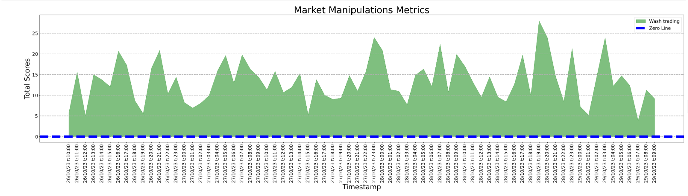
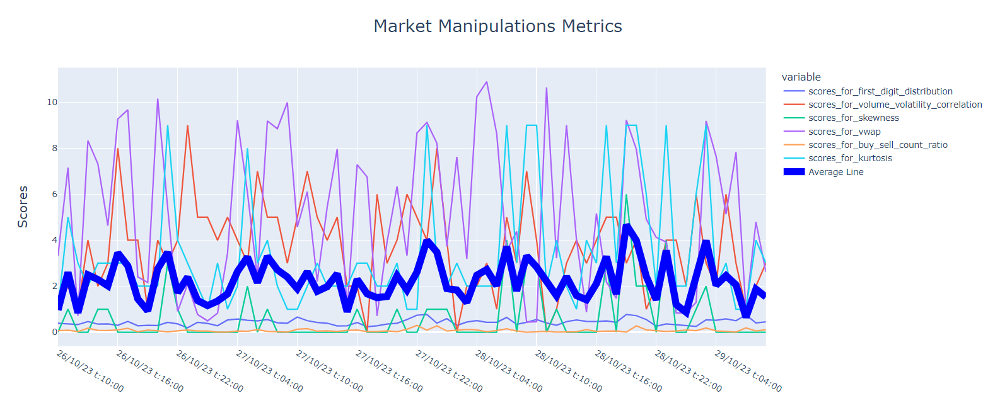

# Market Manipulation Widget

Recommended RapidApi provided me with several Market Health Metrics. I decided to give to each of them scores to make a chart.
### 1) Scores for "first_digit_distribution" metric has the following criteria:

	            Sample	a	            b(Benford’s Law) Scores = abs(a-b)
    1st digit	379	    0.309387755	    0.301	        0.008387755	
    2nd digit	422	    0.344489796	    0.176	        0.168489796	
    3d digit	89	    0.072653061	    0.125	        0.052346939	
    4th digit	63	    0.051428571	    0.097	        0.045571429	
    5th digit	57	    0.046530612	    0.079	        0.032469388	   
    6th digit	28	    0.022857143	    0.067	        0.044142857	
    7th digit	55	    0.044897959	    0.058	        0.013102041	
    8th digit	85	    0.069387755	    0.051	        0.018387755	
    9th digit	47	    0.038367347	    0.046	        0.007632653	
	                            1225		    Total = 0.39053

### 2) Scores for "volume_volatility_correlation" metric has the following criteria:

    Interval	Score
    [1:0.9)	        0
    [0.9:0.8)	1
    [0.8:0.7)	2
    [0.7:0.6)	3
    [0.6:0.5)	4
    [0.5:0.4)	5
    [0.4:0.3)	6
    [0.3:0.2)	7
    [0.2:0.1)	8
    [0.1:0)	        9
    [0:-0.1)	10
    [-0.1:-0.2)	11
    [-0.2:-0.3)	12
    [-0.3:-0.4)	13
    [-0.4:-0.5)	14
    [-0.5:-0.6)	15
    [-0.6:-0.7)	16
    [-0.7:-0.8)	17
    [-0.8:-0.9)	18
    [-0.9:-1]	19

### 3) Regarding curtosis in the theory a standard normal distribution has kurtosis of 3. However in the documentation is written that: "A value of 3.58703 signals a heavy-tailed distribution, indicating a higher likelihood of extreme values." which maybe means that 0 will signal normal distributrion. That is why I decided to give scores for 'volume_distribution_kurtosis' by the below table: 

    Interval	Scores
    [0:1)		0
    [1:2)		1
    [2:3)		2
    [3:4)		3
    [4:5)		4
    [5:6)		5
    [6:7)		6
    [7:8)		7
    [8:9)		8
    [9:infinite]	9

### 4) Scores for "volume_distribution_skewness" metric has the following criteria: 
 
	Interval		Scores
	[0:1)		0
	[1:2)		1
	[2:3)		2
	[3:4)		3
	[4:5)		4
	[5:6)		5
	[6:7)		6
	[7:8)		7
	[8:9)		8
	[9:10]		9

### 5) The buy_sell_count_ratio should be 0.5. All other deviations just taken and taken as a score for example:

	Sample	Standard ratio	Deviation / Score
	0.563	0.5	            0.063

### 6) In documentation there is written that: "A significant difference between the VWAP and the current execution price may indicate manipulation or that the price is moving in a particular direction." So first as far as this API does't provide current prices, I decided to create in python randonmly the prices and find the difference. 

Random price interval = [33 000 : 35 000]

	vwap	    current_price	Difference	Scores = Difference divided by 100
	34292.41	33959.74	    332.67   	3.32

### 7) Total score is just a sum of all previos scores. So the larger this indicator, the greater the likelihood of manipulation and anomalies.

### I created two graphs. One is for total scores. The another shows each type of scores. And actually this graph is made by plotly python, it is supposed to be interactive, where can be choosed separate lines.

