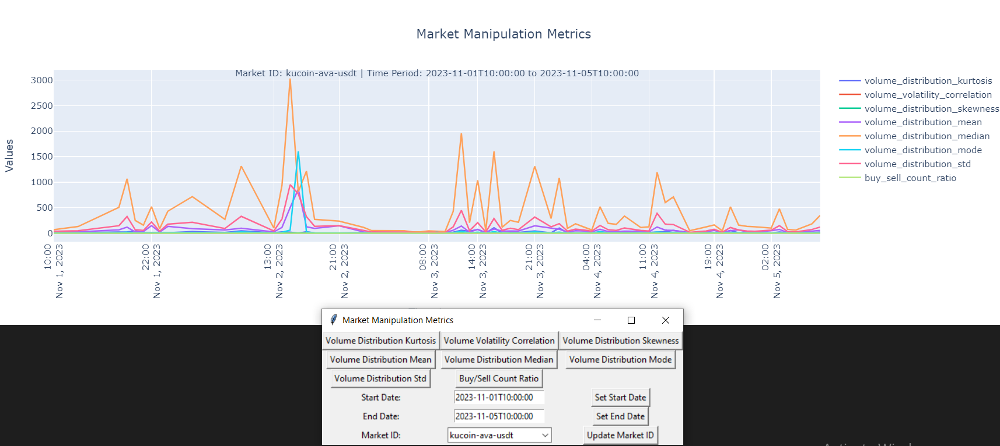

# Market Manipulation Widget

Recommended RapidApi provided me with several Market Health Metrics.
I created the dymanic graph using python. With the following features:
1) It automatically updates the data pressing the button "Update"
2) There is a droplist of market-ids from https://crypto-market-health.p.rapidapi.com/dictionary. So the user can choose the needed one, if no data it will print it out.
3) There is filtering by data
4) I also included buttons for:
    - "Volume Distribution Kurtosis",
    - "Volume Volatility Correlation",
    - "Volume Distribution Skewness",
    - "Volume Distribution Mean",
    - "Volume Distribution Median",
    - "Volume Distribution Mode",
    - "Volume Distribution Std",
    - "Buy/Sell Count Ratio"

