## Summary
1. Recent data reveals a surge in manipulative practices and liquidity issues within Huobi's trading volume since June.
2. Analysis of trade sizes pinpointed heightened activity from volume-generating trading algorithms, detected ahead of public concerns about exchange solvency.
3. Huobi's founder and exchange-linked tokens (HT, TRX) were manipulated, inflating trade volumes and token prices via transaction size adjustments long before.
4. Wash trading criteria comprising volume distribution skewness and fitting estimate show synchronized fluctuations across multiple spot markets (COMP, SOL, LINK, SUI, DOGE).
5. Absence of retail transaction clustering underscores Huobi's artificial trading volume, pointing to a distinct lack of genuine retail presence.
6. Huobi's potential market manipulation of its native token (HT) through order book insights raises user risks and emphasizes the need for caution.

## Metrics used

### Abnormal activity indicator - Average transaction size

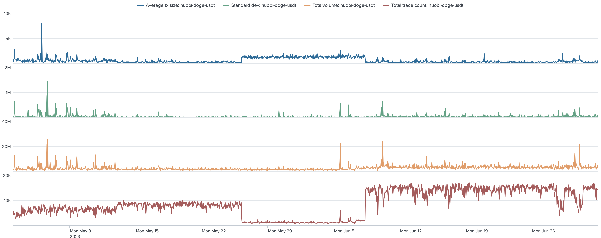
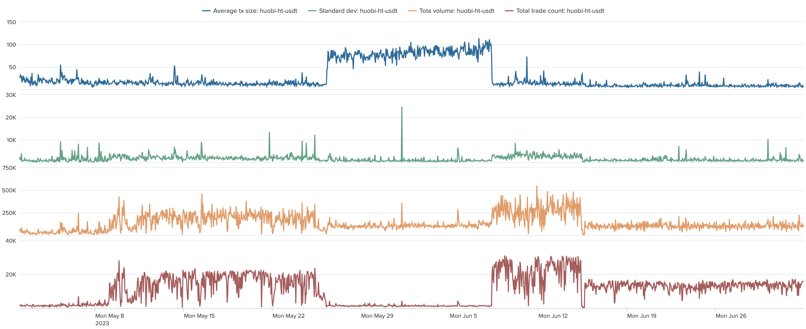
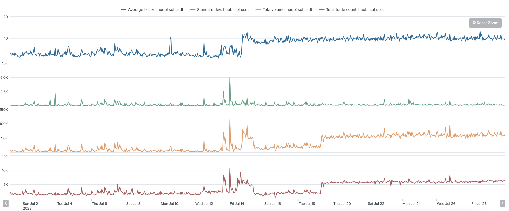
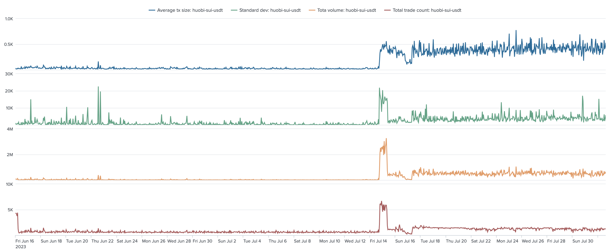

Average transaction size, volume, and trade count on multiple Huobi-s spot market over time, June - July 2023

The main indicator, which signals about abnormal activity, is huge jumps in average size of a transaction. Normally this value is always volatile. 
Low std values and rare but significant changes in average value of this metric strongly indicates dominating artificial trading activity.

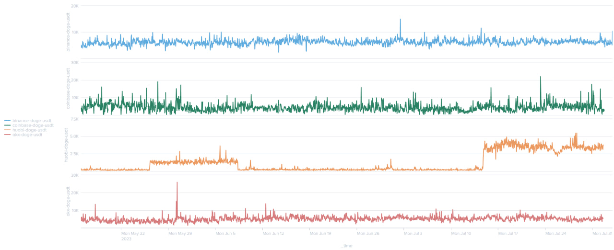

Average transaction size for doge-usdt spot market across multiple exchanges, May - July 2023

### Order printing bots - Volume distribution tail and skewness

Further analysis of the trading volume revealed even more interesting patterns. Typically, trading volume should adhere to a [power law](https://en.wikipedia.org/wiki/Power_law) 
heavy tail distribution, where small-sized trades are common and large-sized trades are rare. To estimate the power-law fitting we use a tail exponent. 
It is expected to be less than 3 in traditional financial markets.

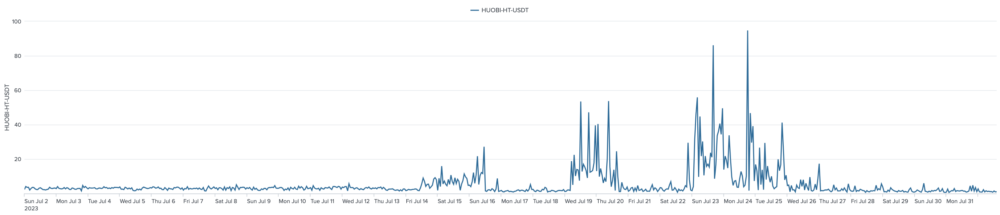

Exponent for ht-usdt spot market on Huobi, July 2023

These metrics reveal the most obvious abnormalities in trade volume distribution. Despite the fact that it cannot be interpreted solely, 
it highlights the presence of individual traders placing high-volume orders as well as the trading bots printing dozens of trades of the same size. 

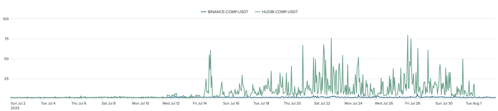
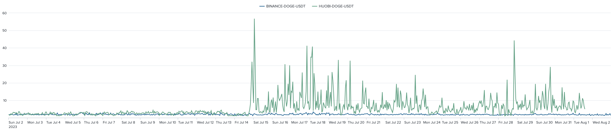
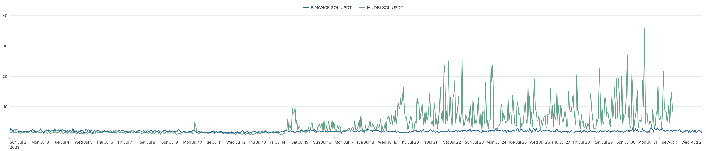

Exponent comparison between Huobi and Binance for different spot markets over time, July 2023 

Given that volume distribution in traditional financial markets is asymmetrical (with a predominance of trades of a small size), 
skewness of such distribution type should be greater than 1. This has nothing to do with the volume distribution built on Huobi-s market data. 

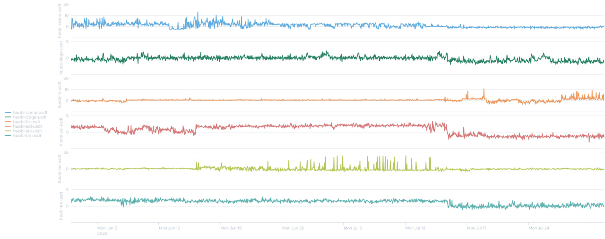

Skewness of trade volume distribution for different Huobi spot markets over time, June - July 2023 

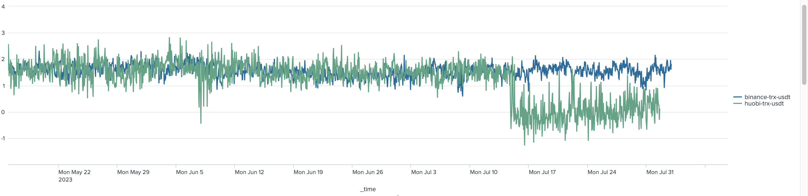

Skewness comparison between Huobi and Binance for trx-usdt spot market over time, May - July 2023 

Below zero skewness values can be spotted visually. They indicate an artificially inflated volume.
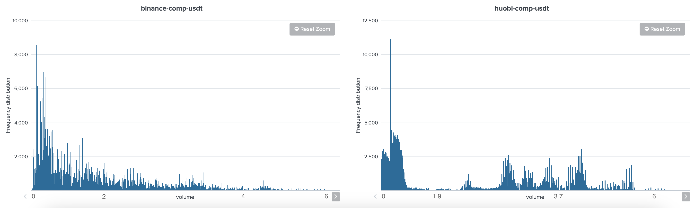
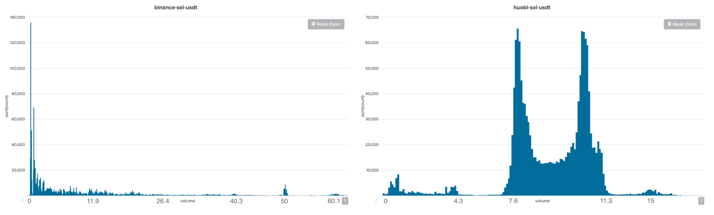

Trade volume distribution samples comparison between Huobi and Binance for comp-usdt and sol-usdt spot markets

### Real users presence - Spotting round-size trades
Recently published [research](https://twitter.com/adamscochran/status/1687959096316542976) suggests Huobi's insufficient funds to cover user obligations, prompting extreme actions like wash trading and manipulation to appear financially sound. There are several ways to match real retail users and reported volumes. 

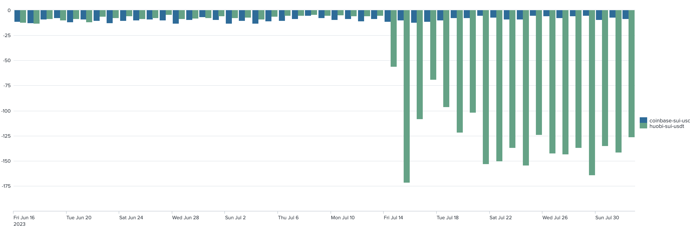

Student's clustering test for 100x rounding, sui-usdt spot market, comparison between Huobi and Coinbase, July 2023

Assuming that retail investors often use round values for trading, the retail clustering indicator compares frequency of round volumes (100, 200, etc.) 
with the frequency of use of other trade sizes. Higher value of this metric represents higher probability of presence of real users. In the Huobi case 
this metric shows extremely low values.

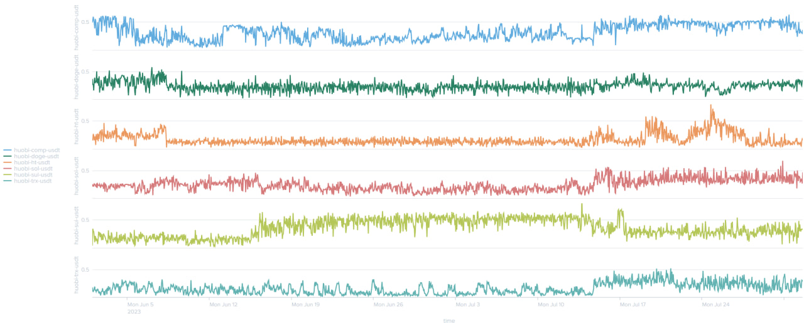

KS test for first digit distribution across different markets on Huobi exchange, June - July 2023  

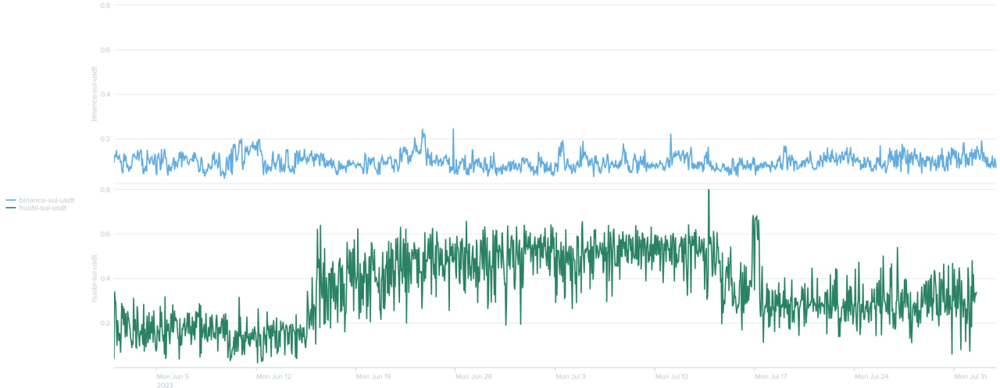
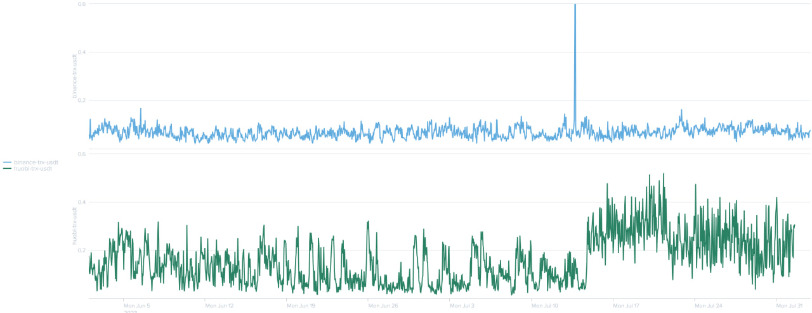

KS test for first digit distribution comparison between Huobi and Binance for different spot markets over time, July 2023  

This metric utilizes Benford's law, which claims that in many real-life sets of numerical data, the leading digit is likely to be small. In the case of artificial 
volumes, first digits will be distributed uniformly, and KS test value will show higher values. In the Huobi case, this metric also indirectly confirms our 
hypothesis.

### Huobi Token - Unveiling Huobi's controlled price dynamics

An exchange's native token, like Huobi's HT, serves as an unofficial indicator of its health. As each exchange is particularly interested in boosting an affiliated token to attract more of customers' attention, its price is more likely to be a subject of manipulation.
 

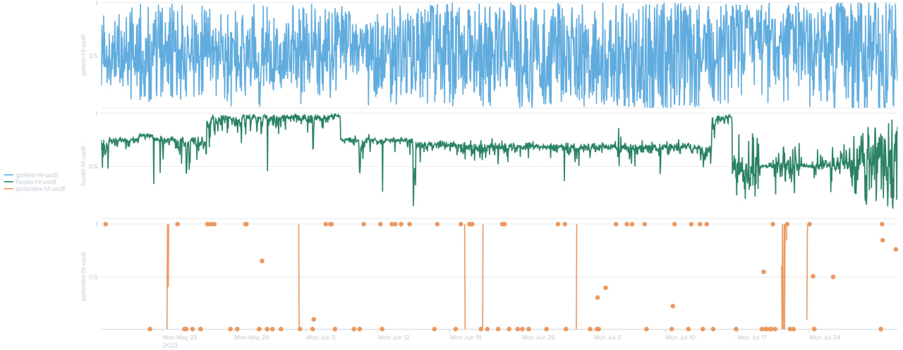

The ratio of "buy" volume and "sell" volume determines price behavior and its furhther movements. In normal conditions this metric is very volatile and looks like a random process (see Gate.io). On the contrary, Huobi Token demonstrates abnormal buy-sell ratio stability that fluctuates within a narrow range.

This suggests potential manipulation, as Huobi may seek to exert control over token price movements. Notably, Huobi's possession of user order data further raises concerns about market manipulation, impacting its users.