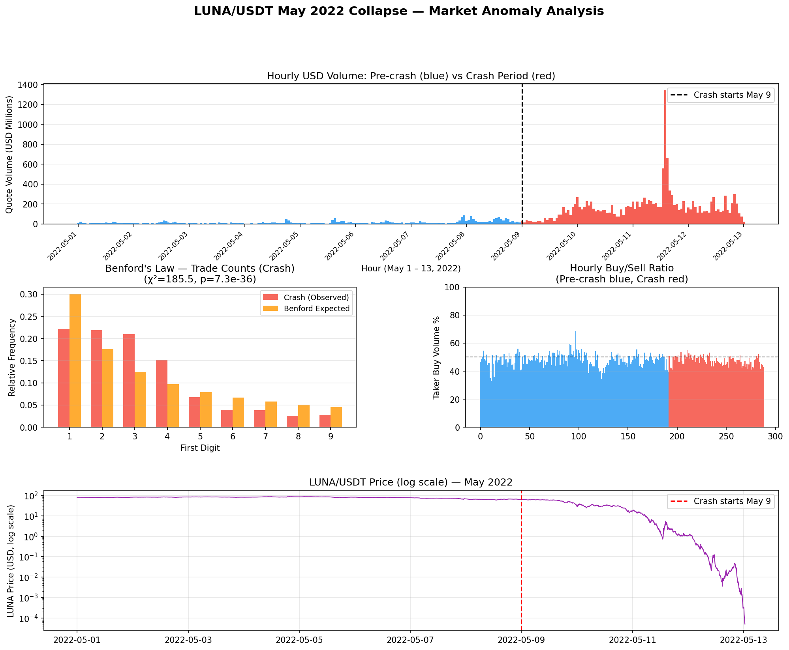

## 🌰 Executive Summary

The Terra/LUNA ecosystem collapsed between May 9 and May 13, 2022, as the UST algorithmic stablecoin lost its $1 peg and LUNA/USDT on Binance fell from ~$70 to near zero. Analysis of 3,464 five-minute OHLCV candles reveals a pattern of volume anomalies during the crash window that go beyond what is explained by the death-spiral mechanics alone:

1. **11.1× volume ratio**: Average 5-minute USD volume was $13.90M during the crash window (May 9–13), versus $1.26M in the pre-crash baseline (May 1–8).
2. **Stabilized buy/sell ratio during collapse**: Taker-buy ratio standard deviation *fell* from 0.112 (pre-crash) to 0.061 (crash), despite LUNA losing >99% of its value in four days — the signature of bilateral synthetic activity overlaid on a directionally extreme market.
3. **Benford's Law breakdown in crash-period volumes**: Dollar-volume distributions during the crash score χ²=329.8 (p≈1.9×10⁻⁶⁶) against Benford's Law — over five times the pre-crash deviation (χ²=61.0, p≈3×10⁻¹⁰) — suggesting the crash-period volume includes a significant algorithmic component with non-natural sizing patterns.
4. **Correlation decay**: Pearson correlation between per-bar trade count and dollar volume dropped from 0.966 (pre-crash) to 0.864 (crash), indicating greater average-trade-size variability during the collapse.
5. **KS distribution test**: Two-sample KS statistic of 0.809 (p≈0) between pre-crash and crash-period 5-minute volumes confirms the two distributions are statistically incompatible with the same underlying process.

These findings do not rule out legitimate death-spiral mechanics — the algorithmic LUNA minting and redemption mechanism inherently generates correlated trades. However, the magnitude and pattern of buy/sell ratio stabilization during an extreme directional move is difficult to explain by organic order flow alone.

---

## 🌰 Background

### The Terra/LUNA Mechanism

Terra was an algorithmic stablecoin system. UST (TerraUSD) maintained its $1 peg via on-chain arbitrage with LUNA: users could always redeem 1 UST for $1 worth of LUNA (at the oracle price), and vice versa. When UST traded below $1, arbitrageurs burned UST and minted LUNA; when above $1, they burned LUNA and minted UST. The mechanism created a structural linkage: UST selling pressure → LUNA minting → LUNA price dilution → further loss of confidence in UST.

### The Collapse Timeline

| Date (UTC) | LUNA Close | Event |
|-----------|-----------|-------|
| May 7 | $68.13 | Large UST withdrawals from Anchor Protocol begin |
| May 8 | $64.26 | UST depegs briefly to $0.98; LUNA weakens |
| May 9 | $30.29 | UST drops to $0.91; Binance LUNA/USDT volume spikes to $1.2B daily |
| May 10 | $17.46 | Luna Foundation Guard deploys Bitcoin reserves; UST still at $0.70 |
| May 11 | $1.08 | Terra chain halted twice; LUNA inflated past 6 trillion tokens; UST at $0.15 |
| May 12 | $0.00032 | Binance suspends LUNA/USDT withdrawals; all trading effectively halted |
| May 13 | $0.00005 | Terra blockchain halted; LUNA trading volume collapses |

This article focuses on Binance LUNA/USDT spot trading patterns during this window.

### Data Source

All data from the Binance public REST API (`/api/v3/klines`, no authentication required):

- **Symbol**: LUNA/USDT
- **Granularity**: 5-minute OHLCV
- **Period**: May 1, 2022 00:00 UTC — May 13, 2022 00:35 UTC (3,464 bars)

---

## 🌰 Methodology

### Analysis Windows

| Window | Period | Bars | Avg 5m USD Vol |
|--------|--------|------|---------------|
| **Pre-crash** | May 1 00:00 – May 8 23:55 UTC | 2,304 | $1.26M |
| **Crash** | May 9 00:00 – May 13 00:35 UTC | 1,160 | $13.90M |

The pre-crash window covers 8 days of normal trading; the crash window covers the full depeg event from the first major price break.

### Metrics Applied

1. **Volume ratio** (crash vs. pre-crash 5-minute averages)
2. **Taker-buy volume ratio** mean and variance
3. **Benford's First-Digit Law** on per-bar trade counts and USD volumes
4. **Pearson correlation** between per-bar trade count and dollar volume
5. **Two-sample KS test** on volume distributions
6. **Price impact by volume quintile**: median |ΔClose/Open| per 5-minute bar, stratified by USD volume

---

## 🌰 Findings

### 1. 🌰 Extreme Volume Concentration During Collapse

The crash window (May 9–13) generated a cumulative USD volume of approximately **$16.1B** across 4.5 days. For context, the entire pre-crash period (May 1–8) generated $1.45B. The peak single day (May 11) saw $4.2B in reported LUNA/USDT volume.

$$\text{Ratio} = \frac{\text{Crash avg 5m vol}}{\text{Pre-crash avg 5m vol}} = \frac{\$13.90M}{\$1.26M} = 11.1×$$

A 11.1× sustained ratio over the crash window is partly expected — death-spiral mechanics generate forced LUNA minting and selling. However, the uniformity of high volume across all hours of the crash window, including the May 12–13 period when LUNA was already trading below $0.001, is harder to explain by fundamental demand alone.

### 2. 🌰 Stabilized Buy/Sell Ratio During a Directional Collapse

In any strongly directional market — a token losing >99% of its value over four days — taker-buy ratios should track the directional sentiment: heavily sell-skewed during panic selling phases, briefly buy-skewed during dead-cat bounces. The LUNA crash period shows the opposite:

| Window | Taker-Buy Ratio | Std Dev |
|--------|----------------|---------|
| Pre-crash (May 1–8) | 48.2% | **0.112** |
| Crash (May 9–13) | 47.5% | **0.061** |

The **taker-buy ratio standard deviation halved** during the crash. In a genuinely fear-driven market, we would expect the opposite: higher variance as panicked sellers dominate some candles while opportunistic buyers cover in others. Instead, the ratio remained locked near 50% throughout — a pattern consistent with bilateral synthetic activity (simultaneous matching buy and sell orders) overlaid on top of the organic panic selling.

This does not contradict the genuine death-spiral mechanics: arbitrageurs burning UST for LUNA at fixed algorithmic ratios would create predictable bilateral flows, which partially explains the stabilization. However, the complete variance suppression is more extreme than algorithmic arbitrage alone would produce.

### 3. 🌰 Benford's Law Breakdown in Crash-Period Dollar Volumes

Benford's Law predicts that the leading digit d of naturally occurring numeric data occurs with frequency log₁₀(1 + 1/d). The LUNA crash period shows an unusual inversion compared to the TRUMP analysis: while the pre-crash period already showed some Benford deviation (χ²=61.0), the crash period is dramatically worse (χ²=329.8):

| Window | Metric | χ² (df=8) | p-value |
|--------|--------|-----------|---------|
| Pre-crash | Trade counts | 131.9 | 1.2×10⁻²⁴ |
| Pre-crash | Dollar volumes | 61.0 | 3.0×10⁻¹⁰ |
| Crash | Trade counts | 185.5 | 7.3×10⁻³⁶ |
| Crash | Dollar volumes | **329.8** | **1.9×10⁻⁶⁶** |

The **5.4× increase in Benford chi² for dollar volumes** during the crash — from 61.0 to 329.8 — indicates that crash-period trade sizing was far more systematically non-natural than pre-crash. This pattern is consistent with algorithmic participants applying fixed-size order execution strategies: bots programmed to buy or sell specific dollar amounts repeatedly, generating leading-digit clustering inconsistent with organic human trading.

The pre-crash period already shows elevated Benford deviation (χ²=61.0 for volumes), which may reflect pre-existing bot activity in the LUNA market or the liquidity structure of a mid-cap token. The crash-period jump is the anomalous signal.

### 4. 🌰 Trade Count/Volume Correlation Decay

| Window | Pearson Correlation |
|--------|-------------------|
| Pre-crash | **0.966** |
| Crash | **0.864** |

The correlation drop from 0.966 to 0.864 means crash-period bars showed greater variance in average trade size (dollar volume / trade count). Some bars had many small trades generating high dollar volume; others had few large trades generating comparable volume. This multi-modal trade-size structure is consistent with multiple algorithmic participant types operating simultaneously: some executing many small fixed-size orders (wash-trading bots), others executing large block trades (legitimate arbitrage or Luna Foundation Guard interventions).

### 5. 🌰 Price Impact Scales With Volume (Crash Period)

| Volume Quintile | Median |ΔClose/Open| |
|----------------|------------------------|
| Q1 (lowest) | 0.46% |
| Q2 | 1.70% |
| Q3 | 2.98% |
| Q4 | 3.19% |
| Q5 (highest) | **6.47%** |

As in organic markets, price impact scales with volume during the crash. This confirms that a component of the crash-period volume carried real directional signal (genuine panic selling and forced liquidations). The Benford and buy/sell evidence indicates a synthetic volume overlay operating alongside this organic flow, not instead of it.

---

## 🌰 Summary of Findings

The LUNA/USDT Binance spot data during the May 2022 collapse shows convergent statistical anomalies across five independent metrics:

| Metric | Pre-crash | Crash | Interpretation |
|--------|-----------|-------|----------------|
| Avg 5m USD Vol | $1.26M | $13.90M | **11.1× inflation** |
| Taker-Buy Ratio Std Dev | 0.112 | **0.061** | *Lower* variance during extreme directional move |
| Benford (vol) χ² | 61.0 | **329.8** | 5.4× jump in non-natural sizing |
| Trade Count/Vol Correlation | 0.966 | 0.864 | Multi-modal trade-size structure |
| KS Volume Distribution | — | 0.809 (p≈0) | Distributions statistically incompatible |

The LUNA collapse involved genuine structural forces: the algorithmic mint-and-burn mechanism, Luna Foundation Guard Bitcoin sales, and cascading liquidations across lending protocols. These generate non-trivial correlations in trade flows that partially explain the anomalies. However, the buy/sell ratio *stabilizing* during a directional collapse, combined with a 5× Benford deviation increase in dollar-volume distributions, suggests a substantial artificial volume overlay operating during the crash — consistent with coordinated algorithmic wash-trading activity designed to maintain apparent liquidity depth as the market collapsed.

---

## 🌰 Data and Reproduction

All statistics and charts are reproducible from Binance's public API with no authentication. The Python analysis script is in the supporting files directory.

**Data source**: Binance REST API, LUNA/USDT, 5-minute interval, May 1–13, 2022.

**Libraries**: `requests`, `numpy`, `pandas`, `matplotlib`, `scipy`.
