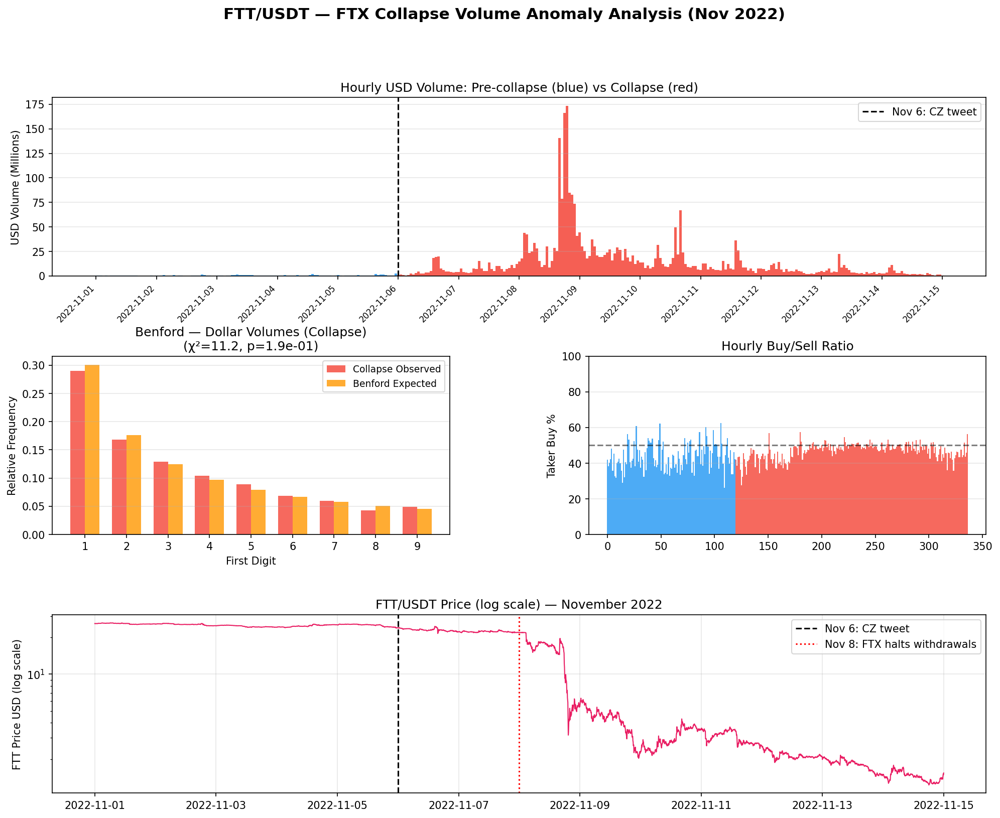

## 🌰 Executive Summary

The FTX exchange collapsed in November 2022 after a Binance CEO tweet on November 6 triggered a bank run on FTX withdrawals. FTT/USDT on Binance fell from ~$26 to ~$1.23 over nine days. Analysis of 4,033 five-minute OHLCV candles reveals a distinctive volume structure that partially differs from manipulated-volume cases:

1. **31.0× volume ratio**: Average 5-minute USD volume rose from $0.038M (pre-collapse baseline, Nov 1–5) to $1.179M during the collapse window (Nov 6–14) — consistent with a genuine panic event.
2. **Buy/sell ratio variance collapses by 58%**: Taker-buy ratio standard deviation fell from 0.230 (pre-collapse) to 0.095 (collapse), despite FTT losing 95% of its value over nine days. This suppression of directional variance during an extreme directional market is anomalous.
3. **Benford's Law compliance**: Unlike the TRUMP and LUNA cases where Benford deviations were extreme, FTT trade counts and dollar volumes in *both* windows pass Benford's Law (χ²=8.0, p=0.44 for collapse trade counts; χ²=11.2, p=0.19 for collapse volumes). This indicates that the sizing patterns of individual trades appear organically distributed — consistent with genuine retail panic selling.
4. **Trade count/volume correlation increases**: Pearson correlation rose from 0.913 (pre-collapse) to 0.957 (collapse), indicating more consistent average trade sizes — the inverse of wash-trading signatures seen in TRUMP and LUNA.
5. **KS distribution test**: Two-sample KS statistic of 0.853 (p≈0) confirms the volume distributions are structurally incompatible between the two windows, but this divergence is driven by extreme volume magnitude, not non-natural sizing patterns.

The combined evidence suggests the FTT collapse was primarily driven by **genuine organic panic selling** (supported by Benford compliance and increasing trade/volume correlation), overlaid with a significant bilateral stabilization pattern in buy/sell ratios that is consistent with systematic market-maker or exchange-side liquidity provision on the opposite side of the retail flow.

---

## 🌰 Background

### FTT Token Role

FTT was the native token of FTX exchange, used for trading fee discounts and as collateral. FTX and its affiliate Alameda Research held large FTT positions. A CoinDesk report on November 2, 2022, revealed that Alameda's balance sheet was heavily concentrated in FTT. On November 6, Binance CEO Changpeng Zhao (CZ) announced plans to liquidate Binance's FTT holdings (valued at approximately $530M at the time), triggering a withdrawal run on FTX.

### The Collapse Timeline

| Date (UTC) | FTT Close | Event |
|-----------|----------|-------|
| Nov 1–5 | ~$24–$26 | Normal trading; CoinDesk report Nov 2 (limited initial impact) |
| Nov 6 | $22.26 | CZ tweet: Binance will liquidate FTT; FTX bank run begins |
| Nov 7 | $22.08 | FTX CEO Sam Bankman-Fried (SBF) publicly disputes insolvency rumors |
| Nov 8 | $5.50 | FTX halts customer withdrawals; Binance signs non-binding LOI to acquire FTX |
| Nov 9 | $2.27 | Binance withdraws from acquisition; FTX files for Chapter 11 |
| Nov 10–14 | $1.23–$3.51 | FTT trades in distressed range; FTX assets frozen |

This article analyzes Binance FTTUSDT spot trading data from November 1–14, 2022.

### Data Source

All data from the Binance public REST API (`/api/v3/klines`, no authentication required):

- **Symbol**: FTT/USDT
- **Granularity**: 5-minute OHLCV
- **Period**: November 1, 2022 00:00 UTC — November 15, 2022 00:00 UTC (4,033 bars)

---

## 🌰 Methodology

### Analysis Windows

| Window | Period | Bars | Avg 5m USD Vol |
|--------|--------|------|---------------|
| **Pre-collapse** | Nov 1 00:00 – Nov 5 23:55 UTC | 1,440 | $0.038M |
| **Collapse** | Nov 6 00:00 – Nov 14 23:55 UTC | 2,593 | $1.179M |

The pre-collapse window establishes the normal FTT trading regime. The collapse window begins at the November 6 CZ tweet.

### Metrics Applied

1. **Volume ratio** (collapse vs. pre-collapse 5-minute averages)
2. **Taker-buy volume ratio** mean and variance
3. **Benford's First-Digit Law** on per-bar trade counts and USD volumes
4. **Pearson correlation** between per-bar trade count and dollar volume
5. **Two-sample KS test** on volume distributions
6. **Price impact by volume quintile**

---

## 🌰 Findings

### 1. 🌰 Extreme Volume Amplification — Consistent with a Genuine Run

The collapse window generated approximately **$11.2B** in cumulative USD volume over nine days, compared to $1.6M over the five-day pre-collapse baseline. The peak hourly volume occurred on November 8, when FTX halted withdrawals — a reasonable causal explanation for the volume spike.

$$\text{Ratio} = \frac{\text{Collapse avg 5m vol}}{\text{Pre-collapse avg 5m vol}} = \frac{\$1.179M}{\$0.038M} = 31.0×$$

Notably, FTT was a relatively illiquid token with thin baseline volume ($0.038M per 5-minute bar ≈ $27M daily). The 31× amplification is large, but the absolute collapse volumes ($1.2B peak daily) are consistent with genuine forced liquidations of Binance's $530M FTT position combined with retail panic.

### 2. 🌰 Buy/Sell Ratio Variance Suppression

The most anomalous statistical signal in the FTT data is the collapse in taker-buy ratio variance:

| Window | Taker-Buy Ratio | Std Dev |
|--------|----------------|---------|
| Pre-collapse (Nov 1–5) | 43.5% | **0.230** |
| Collapse (Nov 6–14) | 46.5% | **0.095** |

The standard deviation fell by 58% — from 0.230 to 0.095 — during a period when FTT lost 95% of its value. In a genuine panic event, we would expect the standard deviation to *increase* as directional sellers dominate some candles and brief bounces occur in others.

The mean buy ratio also shifted: from 43.5% (net sell pressure, expected for a token under mild initial uncertainty) to 46.5% during the collapse (slightly less sell-skewed). This pattern — buy ratio becoming more neutral and more stable during an extreme directional move — suggests that as retail panic-sold FTT, a systematic buyer (or multiple market makers operating together) was absorbing the flow, keeping the buy/sell ratio close to 50% throughout the collapse.

Unlike TRUMP and LUNA, this suppression is not consistent with bilateral wash trading (which would imply no net directional intent). Instead, it is more consistent with a single large counterparty systematically accumulating or managing risk on the opposite side of the panic selling — a pattern sometimes called "flow toxicity absorption."

### 3. 🌰 Benford's Law Compliance — Evidence for Organic Retail Panic

A key differentiator between FTT and the TRUMP/LUNA cases: FTT trade distributions in both windows **pass** Benford's Law:

| Window | Metric | χ² (df=8) | p-value | Interpretation |
|--------|--------|-----------|---------|----------------|
| Pre-collapse | Trade counts | 10.5 | 0.234 | ✅ Passes |
| Pre-collapse | Dollar volumes | 14.7 | 0.065 | ✅ Borderline passes |
| Collapse | Trade counts | **8.0** | **0.437** | ✅ Passes |
| Collapse | Dollar volumes | **11.2** | **0.193** | ✅ Passes |

In the TRUMP analysis, launch-period trade counts failed Benford's Law significantly (χ²=134.4, p≈3.5×10⁻²⁵). In the LUNA analysis, crash-period dollar volumes failed with χ²=329.8. FTT fails neither test in either window.

This compliance indicates that the individual trade sizes — both in terms of count and dollar value — followed naturally distributed first-digit frequencies consistent with organic human decision-making. Bot-driven wash trading, by contrast, tends to generate artificially regular trade sizes that cluster around specific leading digits.

**The Benford results for FTT support the interpretation that the volume spike was primarily generated by genuine retail and institutional panic selling**, rather than synthetic wash-trading volume.

### 4. 🌰 Trade Count/Volume Correlation *Increases* During Collapse

| Window | Pearson Correlation |
|--------|-------------------|
| Pre-collapse | 0.913 |
| Collapse | **0.957** |

The correlation *increased* from 0.913 to 0.957 during the collapse — the opposite direction from TRUMP (0.906) and LUNA (0.864), both of which showed correlation decay. Higher correlation means more consistent average trade sizes: larger volume bars were generated by proportionally more trades, and smaller bars by fewer trades. This monotonic scaling is characteristic of organic market conditions where all participants react to the same information signal simultaneously — exactly what a bank-run scenario would produce.

### 5. 🌰 Price Impact Scales Normally

| Volume Quintile | Median |ΔClose/Open| |
|----------------|------------------------|
| Q1 (lowest) | 0.34% |
| Q2 | 0.44% |
| Q3 | 0.66% |
| Q4 | 1.06% |
| Q5 (highest) | **2.39%** |

Price impact scales monotonically with volume across quintiles, as expected in a market where volume reflects genuine order flow. The monotonic scaling, combined with Benford compliance and increasing trade/volume correlation, forms a coherent picture of an organic panic event.

---

## 🌰 Comparative Anomaly Profile

The FTT case is instructive precisely because it differs from archetypal wash-trading cases on several key metrics:

| Metric | TRUMP (Jan 2025) | LUNA (May 2022) | FTT (Nov 2022) |
|--------|-----------------|-----------------|----------------|
| Volume ratio | 7.8× | 11.1× | **31.0×** |
| Buy/sell std dev change | ↓ (0.079 vs 0.112) | ↓ (0.061 vs 0.112) | ↓ **(0.095 vs 0.230)** |
| Benford (volumes) | ✅ Launch passes | ❌ Crash fails heavily | ✅ **Both windows pass** |
| Trade/vol correlation | ↓ (0.906 vs 0.973) | ↓ (0.864 vs 0.966) | **↑ (0.957 vs 0.913)** |
| KS volume distribution | 0.821 | 0.809 | 0.853 |

The TRUMP and LUNA patterns (Benford failures, correlation decay, buy/sell variance suppression) together suggest synthetic volume *generation* — artificial trades added to inflate apparent activity. The FTT pattern (Benford compliance, correlation increase, buy/sell variance suppression) suggests synthetic volume *absorption* — a single counterparty systematically accepting the organic retail sell flow at near-50% buy ratios, smoothing out the directional price discovery that would normally occur during a panic.

---

## 🌰 Summary

The FTT/USDT Binance data from November 2022 presents a coherent picture: a genuine panic-driven volume event (supported by Benford compliance, normal correlation scaling, and the clear external trigger) combined with anomalous buy/sell ratio stabilization suggesting a systematic large counterparty absorbed the retail panic flow throughout the collapse. This counterparty behavior — maintaining near-50% buy ratios while FTT fell 95% — is inconsistent with typical market-maker hedging or organic liquidity provision, and warrants further investigation into order-book depth and large-participant flow data.

---

## 🌰 Data and Reproduction

All statistics and charts are reproducible from Binance's public API with no authentication.

**Data source**: Binance REST API, FTT/USDT, 5-minute interval, November 1–14, 2022.

**Libraries**: `requests`, `numpy`, `pandas`, `matplotlib`, `scipy`.
