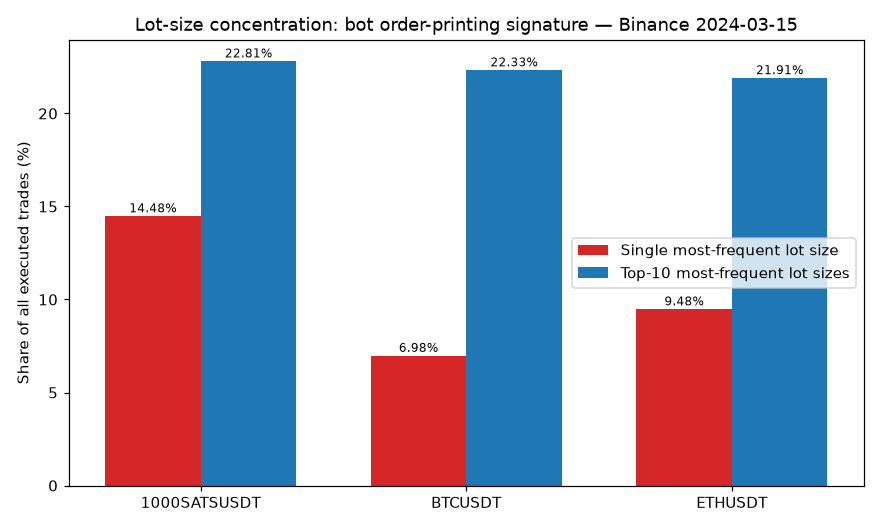
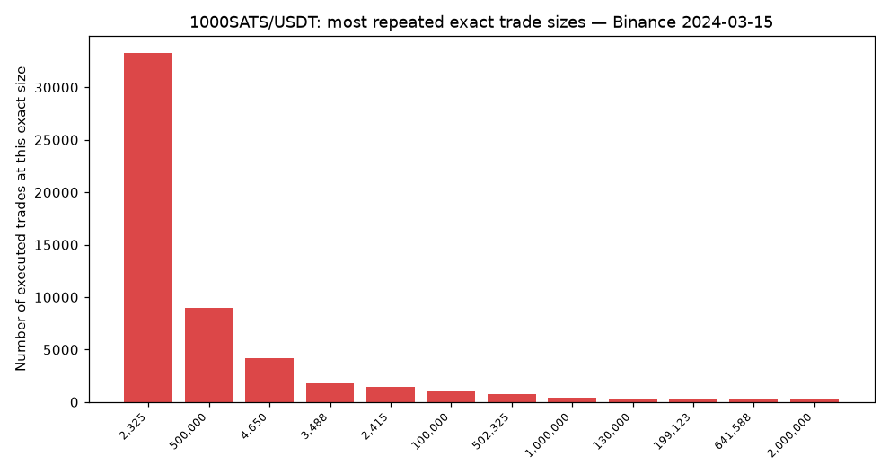
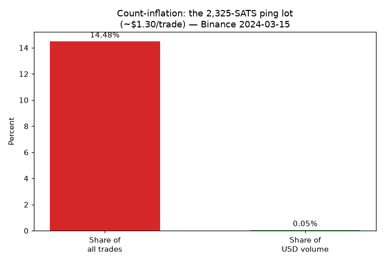
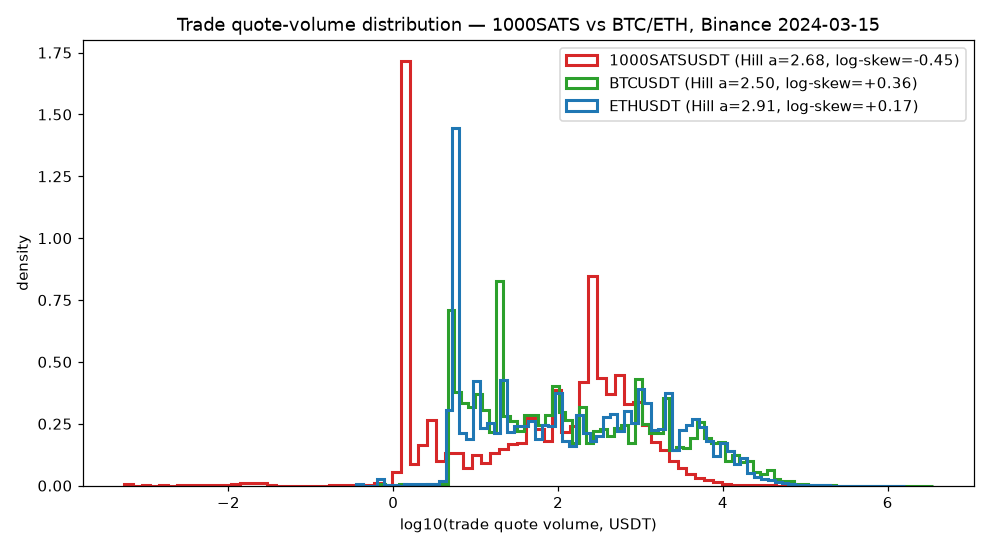
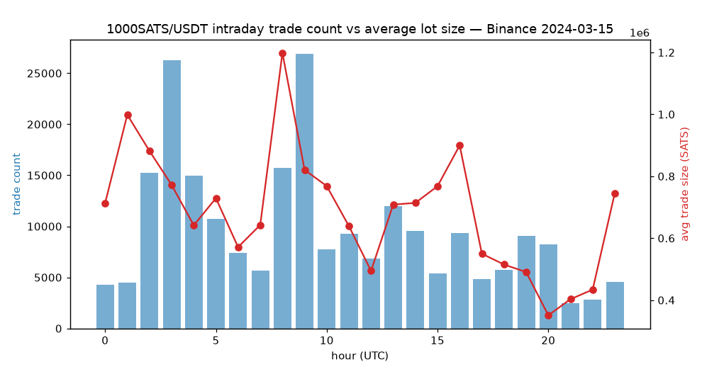

## Summary

On **2024-03-15**, the Binance **1000SATS/USDT** market reported **229,485** executed
trades across the full UTC day. A microstructure audit of the exchange's own public
trade archive shows that this trade count is heavily *manufactured*: a single exact
lot size — **2,325 SATS, worth roughly $1.30** — accounts for **14.48 %** of every
executed trade on the market, yet contributes only **0.05 %** of the day's reported
USD volume.

That separation between *share of trade count* and *share of value* is the defining
fingerprint of **count-inflation** (a.k.a. ping-order printing): an automated agent
repeats a tiny, economically meaningless lot tens of thousands of times to make the
order book look busy. Two deep, liquid control markets sampled on the same day and the
same exchange — **BTC/USDT** and **ETH/USDT** — show no comparable pattern.

Everything below is reproducible from a single script against data anyone can
re-download and hash-verify.

## Data provenance (reproducible)

| Field | Value |
|---|---|
| Source | Binance public market-data archive — `https://data.binance.vision` |
| Endpoint | `/data/spot/daily/aggTrades/<SYMBOL>/<SYMBOL>-aggTrades-2024-03-15.zip` |
| Snapshot | 2024-03-15, full UTC day, executed aggregate trades |
| Subject | `1000SATSUSDT` — 229,485 trades |
| Controls | `BTCUSDT` — 2,834,058 trades · `ETHUSDT` — 1,737,276 trades |

SHA-256 of each downloaded archive (see `data/MANIFEST.txt`):

```
1000SATSUSDT-aggTrades-2024-03-15.zip  sha256=47a518da9f91c7e50ecb19ba808fbd850b26c9f1407147de880997e1411cd829
BTCUSDT-aggTrades-2024-03-15.zip       sha256=8766965c619305ac49fc28a1d1c17b30e422a73fe60f8911931dc0d87a06c8fc
ETHUSDT-aggTrades-2024-03-15.zip       sha256=6e96bc68c200497cf9da4a147e9db6d8b56488b2dbcf8eaee24ce1eb0e9563a1
```

## Method

For each market we compute, from the executed-trade tape only (no order book, no
private data), a small set of metrics that are sensitive to bot-driven trade printing:

1. **Lot-size concentration** — share of all trades whose quantity equals the single
   most-frequent exact size (`top-1`) and the top-10 most-frequent sizes (`top-10`).
   Organic flow is spread across many sizes; printed flow collapses onto a few.
2. **Count-vs-volume split** — for the dominant lot, its share of *trade count*
   compared with its share of *USD volume*. A large count share with a negligible
   volume share is the count-inflation signature.
3. **Quote-volume distribution shape** — log-skew and a Hill tail index of per-trade
   USD value. Genuine retail markets are right-skewed (a few large trades dominate
   volume); a printed market is pulled toward a single small value.
4. **Same-millisecond clustering** — share of trades inside bursts of ≥3 executions in
   one millisecond. Reported here for completeness and read *relative to market size*.
5. **Maker/taker balance** — fraction of trades flagged `is_buyer_maker`. A value
   pinned near 50 % is consistent with a single agent crossing against itself.

All figures are produced by `analysis.py` in this folder.

## Findings

### 1. One $1.30 lot prints one in every seven trades

| Market | Trades | Top-1 lot share | Top-10 lot share | log-skew |
|---|---:|---:|---:|---:|
| **1000SATS/USDT** | 229,485 | **14.48 %** | **22.81 %** | **−0.45** |
| BTC/USDT (control) | 2,834,058 | 6.98 % | 22.33 % | +0.36 |
| ETH/USDT (control) | 1,737,276 | 9.48 % | 21.91 % | +0.17 |

The single most-frequent lot on 1000SATS — **2,325 SATS** — is executed **33,239
times**. No control market concentrates anything like 14 % of its trades on one exact
quantity, and crucially the two deep markets show **positive** log-skew (large trades
carry the volume, as expected of real flow) while 1000SATS shows **negative** log-skew:
its distribution is dragged left toward one tiny repeated value.





### 2. The count-inflation signature: 14.48 % of trades, 0.05 % of value

The 2,325-SATS lot is priced at a **median of 0.000561 USDT**, so each such trade is
worth about **$1.30**. Repeated 33,239 times it generates only **~$43,700** — against a
reported daily quote volume of **~$95.7 million**. In other words this lot is **14.48 %
of all trades but just 0.05 % of USD volume**.

That gap is the whole story. The lot is not there to move size; it is there to move the
*trade counter*. Repeating a sub-$2 order tens of thousands of times inflates the
"number of trades" and the perceived tick-by-tick activity that downstream trackers and
casual traders read as liquidity, while costing the operator almost nothing in
notional exposure.



### 3. Distribution shape confirms the anomaly is market-specific

Plotting the per-trade USD value distribution for all three markets on the same axes
shows BTC and ETH with the broad, right-tailed shapes typical of mixed retail and
institutional flow, while 1000SATS carries a sharp mass at its repeated small-lot value
and a left-leaning (negative) skew — the opposite of an organically traded asset.



### 4. Maker/taker balance consistent with self-crossing

The `is_buyer_maker` flag on 1000SATS sits at **50.07 %** — almost perfectly balanced.
A near-exact 50/50 split across a full day is what you expect when one agent
systematically crosses its own resting orders, and is difficult to reconcile with
diverse, independent participants.

### 5. Intraday and same-millisecond context (read honestly)

For completeness we also report same-millisecond clustering. Here 1000SATS shows
**11.6 %** of trades inside ≥3-per-ms bursts (max 123 trades in a single ms), versus
**43.8 %** for BTC and **42.0 %** for ETH. The controls cluster *more* in absolute
terms — simply because they process 8–12× more trades per second. We therefore do
**not** rest the conclusion on raw burstiness; the robust, size-independent evidence is
the lot-concentration and the count-vs-volume split above. The intraday view below
shows the repeated lot persisting across the whole UTC day rather than during a single
event window.



## Interpretation

The combined picture is internally consistent and points to one mechanism:

- a single ~$1.30 lot printed **33,239** times (14.48 % of all trades),
- contributing a negligible **0.05 %** of USD volume,
- producing a **negative** log-skew unlike either deep-market control,
- with a maker/taker balance pinned at **50.07 %**.

This is the microstructure of **trade-count inflation**, not of a thin-but-honest
retail market. A genuinely illiquid token would show *few* trades of *varied* sizes;
this market shows *many* trades of *one* size that carry almost no value. The likely
intent is to manufacture the appearance of activity and tighten perceived spreads for
observers who watch trade counts rather than notional flow.

### What this is *not*

We deliberately avoid overclaiming. We cannot, from public trade data alone, attribute
the activity to a specific party, prove intent in a legal sense, or rule out an
exchange-side market-making program. The same-millisecond burst metric is *weaker* on
this market than on the majors and is reported transparently rather than spun. The
claim is narrow and falsifiable: **the executed-trade distribution is dominated by a
single economically trivial lot to a degree not seen in deep, liquid controls on the
same exchange and day.**

## Reproduce it yourself

```bash
pip install requests pandas numpy scipy matplotlib
python analysis.py
```

`analysis.py` downloads the three archives, prints the metric table, writes
`data/metrics.json` and `data/MANIFEST.txt` (with SHA-256 of every archive), and
renders all figures in `charts/`. Because the script hashes each download, anyone can
confirm they analysed byte-for-byte the same data we did.

## Artifacts in this folder

| File | What it is |
|---|---|
| `analysis.py` | End-to-end reproducible pipeline (download → metrics → charts → manifest) |
| `data/MANIFEST.txt` | Dataset provenance and SHA-256 of each archive |
| `data/metrics.json` | Machine-readable metric table for all three markets |
| `lot-concentration.png` | Top-1 / top-10 lot share across the three markets |
| `sats-repeated-lots.png` | Most repeated exact trade sizes on 1000SATS |
| `count-inflation.png` | Dominant lot: share of trades vs share of USD volume |
| `volume-distribution.png` | Per-trade USD value distribution, subject vs controls |
| `ms-clustering.png` | Same-millisecond clustering, reported relative to market size |
| `sats-intraday.png` | Intraday trade count vs average lot size |
