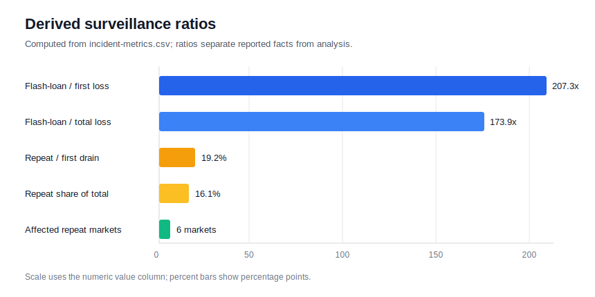

## Summary

UwU Lend's June 2024 exploit is a market-health case because the attacker did
not only abuse contract logic; the trade sequence distorted a price signal that
the lending market treated as fair value. Public incident reports attribute the
first drain to manipulation of the sUSDe oracle through large swaps against
Curve liquidity, followed by borrowing against the distorted value and removing
other collateral from the protocol.

Two facts make the incident useful for surveillance:

1. The oracle input was movable with short-lived liquidity, so a venue-level
   liquidity shock became a protocol-wide collateral signal.
2. A second drain occurred on June 13, after the first public remediation
   statement, showing that incident response should monitor residual bad debt,
   isolated markets, and intended-function withdrawals after an oracle event.

The public loss estimates vary by source, but the first event is consistently
reported around $19.3 million to $20 million, and the second event around
$3.7 million. The companion dataset in `incident-metrics.csv` records the
event-level signals used below. A second companion file,
`derived-surveillance-metrics.csv`, converts those reported facts into
repeatable surveillance ratios.

## Metrics Used

The dataset is intentionally small because the public record does not expose a
full transaction-level order book for the manipulated Curve route. It still
turns the article into a repeatable market-health case by separating reported
facts from derived surveillance checks:

| Metric                           | Dataset signal                                     | Why it matters                                                                                |
| -------------------------------- | -------------------------------------------------- | --------------------------------------------------------------------------------------------- |
| Reported first-drain loss        | `first-drain / reported-loss`                      | Establishes incident severity and the value at risk from the distorted collateral accounting. |
| Reported attack vector           | `first-drain / attack-vector`                      | Links the loss to oracle-source manipulation rather than generic smart-contract malfunction.  |
| Reported flash-loan notional     | `temporary-capital / reported-flash-loan-notional` | Marks when temporary capital was large enough to overwhelm ordinary source-pool depth.        |
| Reported second-drain loss       | `second-drain / reported-loss`                     | Measures residual exposure after the first public remediation and reimbursement statement.    |
| Reported affected second markets | `second-drain / affected-markets`                  | Shows whether one oracle event propagated into multiple borrowing markets before containment. |

Those fields are enough to evaluate three operational checks: oracle-source
depth versus accepted collateral value, temporary capital versus executable
pool liquidity, and post-incident market isolation versus repeated outflows.

## Derived Surveillance Features

The issue asks for data-backed conclusions rather than a public-source recap.
Because public reporting does not expose full Curve route order books for the
manipulated trade path, this article keeps source claims and derived metrics
separate. The derived dataset uses only the numeric fields in
`incident-metrics.csv`.

| Derived feature             | Formula                         | Value | Interpretation                                                                                |
| --------------------------- | ------------------------------- | ----: | --------------------------------------------------------------------------------------------- |
| Flash-loan / first loss     | `4000 / 19.3`                   | 207.3 | Temporary capital was over 200 times the reported first loss, so notional alone was abnormal. |
| Flash-loan / total loss     | `4000 / (19.3 + 3.7)`           | 173.9 | Even after including the repeat drain, temporary capital dwarfed realized extractable value.  |
| Repeat-drain / first drain  | `3.7 / 19.3`                    |  19.2 | The second drain was about one-fifth of the first, a material residual-exposure signal.       |
| Repeat-drain share of total | `3.7 / (19.3 + 3.7)`            |  16.1 | Roughly one-sixth of reported losses occurred after the first remediation statement.          |
| Affected repeat markets     | count of reported market labels |   6.0 | Residual exposure was multi-market, not limited to one isolated debt asset.                   |

Those ratios are intentionally simple, but they are more useful for automated
triage than narrative loss estimates. A market-health monitor can compute the
same features for future events and route incidents for manual review when
temporary capital is orders of magnitude above realized loss, or when a
post-remediation loss exceeds a small single-digit percentage of the first
event.

## Event Timeline

| Date       | Event                                                                                                     | Market-health interpretation                                                                                      |
| ---------- | --------------------------------------------------------------------------------------------------------- | ----------------------------------------------------------------------------------------------------------------- |
| 2024-06-10 | UwU Lend was drained for about $19.3 million, according to CoinDesk's summary of security-firm estimates. | Large cross-asset outflows followed a distorted lending-market price input rather than ordinary user withdrawals. |
| 2024-06-10 | SlowMist described the core attack as direct manipulation of the sUSDe oracle via large Curve swaps.      | A low-resilience oracle source turned concentrated trading into a collateral valuation change.                    |
| 2024-06-13 | DL News reported that the attacker used a multibillion-dollar flash loan in the earlier attack.           | Temporary capital that exceeds source liquidity is a useful pre-trade risk signal.                                |
| 2024-06-13 | Crypto.news reported a second drain of about $3.7 million from UwU Lend markets.                          | A second outflow after remediation indicates residual exposure and insufficient post-incident market isolation.   |

## Manipulation Pattern

The attack pattern resembles a venue-to-lending feedback loop:

1. Source temporary capital through flash loans.
2. Trade against liquidity used by the price provider.
3. Move the sUSDe/USDe reference price away from fair value.
4. Use UwU Lend's manipulated collateral accounting to borrow other assets.
5. Convert the proceeds and unwind temporary liquidity.

That pattern differs from ordinary liquidity-provider loss. A healthy lending
market can absorb price movement only when the price source is deep, independent
and slow enough to resist one-transaction balance changes. Here, the reported
oracle path let concentrated swaps change the accounting value fast enough for
the borrowing market to act on it.

## Market-Health Signals

### Oracle versus fair-value divergence

For a staked stablecoin such as sUSDe, market-health monitoring should compare
the protocol's accepted oracle price against independent venue prices and
redemption-related reference values. A sudden oracle-only move should be treated
as a liquidation and borrowing freeze signal, not just as volatility.

Useful checks:

- Flag any oracle update where the source pool moves materially more than
  independent sUSDe/USDe markets in the same block window.
- Require minimum source-liquidity depth before accepting an oracle update.
- Add a cool-down period when the oracle source has just absorbed a large swap.

### Flash-loan capital concentration

DL News reported that the first attack used a flash loan of roughly $4 billion.
The important market-health signal is not the exact lender list by itself; it is
the sudden appearance of coordinated temporary capital that is much larger than
the normal liquidity available in the oracle source.

Useful checks:

- Track borrowed notional entering the oracle source and the lending protocol in
  the same transaction bundle.
- Compare flash-loan notional with the source pool's executable depth.
- Quarantine markets when temporary capital can move the reference source by
  more than the liquidation threshold.

### Borrowed-asset spread after manipulation

CoinDesk reported that the attacker drained a mix of WETH, WBTC and stablecoins
before swapping much of the value on Uniswap. Crypto.news later reported the
second incident touched uDAI, uWETH, uLUSD, uFRAX, uCRVUSD and uUSDT markets.
That spread indicates that a single manipulated oracle can create multi-market
losses when borrowing limits are shared across collateral and debt assets.

Useful checks:

- Freeze new borrowing across all markets that accept the manipulated collateral.
- Separate "oracle contained" from "bad-debt contained"; the second is what
  matters before reopening markets.
- Continue anomaly monitoring after repayment or reimbursement announcements.

## Why This Belongs in Market Health

The incident is a practical example of how market manipulation can cross the
boundary between trading venues and lending protocols. The public signal is not
only a stolen-funds event; it is a failure of price-source quality, depth
checks, and post-incident market controls.

For future surveillance, the most useful indicators are:

- source-pool depth versus accepted collateral value;
- oracle price movement versus independent fair-value references;
- flash-loan notional versus normal source liquidity;
- cross-market borrow attempts immediately after an oracle move;
- repeated withdrawals after a remediation statement.

The strongest practical rule from the derived dataset is that remediation
should not be treated as complete when the oracle source is patched. The
repeat-drain ratio and six affected markets show that the review gate must also
measure remaining borrowable value, bad-debt paths, and market isolation.

## References

- CoinDesk, ["DeFi Protocol UwU Lend Suffers $19.3M Exploit: Arkham"](https://www.coindesk.com/business/2024/06/10/defi-protocol-uwu-lend-suffers-193m-expolit-arkham)
- SlowMist analysis republished by Coinlive, ["UwU Lend Hack Analysis"](https://www.coinlive.com/news/uwu-lend-hack-analysis)
- DL News, ["UwU Lend hacker swipes another $3.7m amid payback plan for earlier attack"](https://www.dlnews.com/articles/defi/0xsifu-protocol-uwu-lend-hacked-again-amid-payback-plan/)
- Crypto.news, ["UwU Lend suffers its second $3.7m hack by same attacker"](https://crypto.news/uwu-lend-suffers-its-second-3-7m-hack-by-same-attacker)
