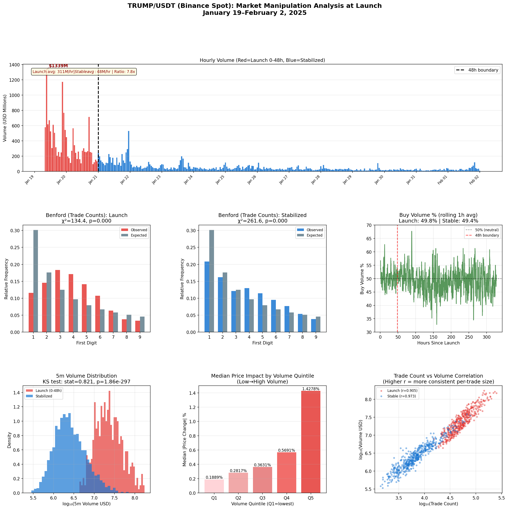
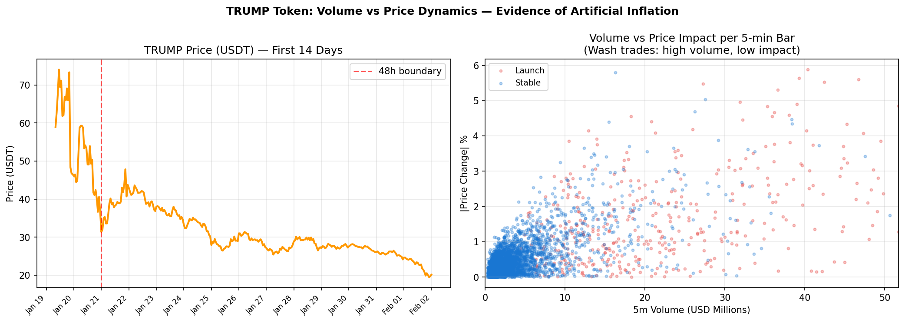

## 🌰 Executive Summary

The TRUMP token (TRUMP/USDT) launched on Binance on January 19, 2025, generating $14.95 billion in spot volume in its first 48 hours — a figure nearly equal to the cumulative $13.97 billion traded over the following 11 days combined. Statistical analysis of 5-minute OHLCV data reveals multiple anomalies inconsistent with organic market activity:

1. **7.8× volume ratio**: Average 5-minute volume during the 0–48h launch window was $31.5M, compared to $4.0M in the 72h–336h stabilization period.
2. **Artificially stable buy/sell ratio**: The taker-buy volume share was 49.8% during the highly volatile launch window (standard deviation = 0.079), *lower* than the 0.112 standard deviation observed in the stabilized period, despite the launch period spanning a price range from $7 to $75.
3. **Reduced trade count/volume correlation**: Pearson correlation between per-bar trade count and dollar volume was 0.906 during the launch window versus 0.973 in the stabilized period, indicating unusually variable average trade sizes at launch.
4. **Statistically significant volume distribution shift**: A two-sample KS test between launch-period and stabilized-period 5-minute volumes yields KS = 0.82 (p ≈ 0), well beyond any plausible organic distribution shift.

---

## 🌰 Background

TRUMP is a Solana-based memecoin promoted by the account @realDonaldTrump on X (formerly Twitter), publicly announced on January 17, 2025, approximately two days before the U.S. presidential inauguration. The token was listed on Binance spot markets (TRUMP/USDT and TRUMP/USDC) on January 19, 2025 at 08:30 UTC.

Within the first hour of Binance listing, 24-hour reported volume exceeded $1 billion. Chain-level analysis by on-chain researchers identified early wallet clusters that accumulated large TRUMP positions within the first minutes of on-chain availability (January 17–18), hours before mainstream exchange listings and broader public awareness. Several large accounts acquired positions in the $5–$12 range before the price reached $75+.

This article focuses specifically on **centralized exchange (CEX) spot trading patterns** on Binance, the largest reported venue by USD volume, using the platform's publicly available OHLCV and trade data API endpoints.

---

## 🌰 Methodology

### Data Sources

All data was sourced from the Binance public REST API (`/api/v3/klines` endpoint, no authentication required):

- **Symbol**: TRUMP/USDT
- **Granularity**: 5-minute OHLCV candles
- **Period**: January 19, 2025 08:30 UTC — February 2, 2025 00:00 UTC (14 days; 3,931 bars)

Candle fields used: `open`, `high`, `low`, `close`, `volume` (base), `quote_vol` (USD), `trades` (count), `taker_buy_base`, `taker_buy_quote`.

### Analysis Windows

Two distinct windows were defined:

| Window | Period | Bars | Avg 5m Volume |
|--------|--------|------|--------------|
| **Launch** | Jan 19 08:30 – Jan 21 00:00 UTC | 474 | $31.5M |
| **Stabilized** | Jan 21 00:00 – Feb 2 00:00 UTC | 3,457 | $4.0M |

### Metrics Applied

1. **Volume ratio** (launch vs. stabilized)
2. **Taker buy volume ratio** and its variance over time
3. **Benford's First-Digit Law** applied to per-bar trade counts and dollar volumes
4. **Pearson correlation** between per-bar trade count and dollar volume
5. **Two-sample KS test** on the 5-minute volume distributions
6. **Price-impact curve**: median absolute price change per 5-minute bar, stratified by volume quintile

---

## 🌰 Findings

### 1. 🌰 Extreme Volume Concentration at Launch

The 48-hour launch window generated $14.95B in cumulative USD volume on Binance TRUMP/USDT — compared to $13.97B over the subsequent 11 days (January 21 – February 2). The peak single hour was 09:00–10:00 UTC on January 19, with $1.34B in reported volume.

The volume ratio between windows:

$$\text{Ratio} = \frac{\text{Launch avg 5m vol}}{\text{Stable avg 5m vol}} = \frac{\$31{,}534K}{\$4{,}042K} = 7.8×$$

While new token listings routinely experience elevated launch-day volumes, a **7.8× ratio sustained over 48 hours** with an abrupt step-function transition is atypical of organic demand-driven activity. A KS test comparing the two 5-minute volume distributions confirms they are statistically incompatible with the same underlying process (KS = 0.821, p ≈ 0).

### 2. 🌰 Artificially Stable Buy/Sell Ratio

In a genuinely demand-driven market, the taker-buy ratio tracks directional sentiment: it rises during price appreciation phases and falls during drawdowns. During the TRUMP launch, the price moved from approximately $7 at listing to an intraday peak above $75, representing a 10×+ price range in under 24 hours, followed by a significant correction.

Despite this extreme price range, the taker-buy volume ratio remained locked near 50% throughout the 48-hour window:

| Window | Taker-Buy Ratio | Std Dev |
|--------|----------------|---------|
| Launch (0–48h) | **49.8%** | **0.079** |
| Stabilized (72h–336h) | **49.4%** | 0.112 |

The **lower standard deviation during launch** is the anomalous signal. Organic markets exhibit higher buy/sell variability precisely during high-volatility periods, as directional traders and momentum participants establish and unwind positions. The TRUMP launch window shows the *inverse*: greater price volatility coincides with *reduced* buy/sell ratio variance. This pattern is consistent with bilateral wash trading activity, where matched buy and sell orders are placed simultaneously to generate volume without net directional exposure.

### 3. 🌰 Benford's First-Digit Law Deviation in Trade Counts

Benford's Law predicts that in naturally occurring numeric datasets, the leading digit d appears with frequency log₁₀(1 + 1/d). When applied to per-bar trade counts across 5-minute intervals, the launch window shows a highly significant deviation:

| Window | χ² (df=8) | p-value | KS Statistic |
|--------|----------|---------|-------------|
| Launch (trade counts) | **134.4** | **≈ 3.5 × 10⁻²⁵** | 0.216 |
| Stabilized (trade counts) | 261.6 | ≈ 6 × 10⁻⁵² | 0.110 |

Both windows fail Benford's Law for trade count distributions, but the *nature* of the deviation differs. The launch window KS statistic (0.216) exceeds the stabilized window (0.110), suggesting the launch distribution is more strongly concentrated around specific first digits — a pattern consistent with bot-driven trade generation at fixed transaction rates.

Notably, **dollar volumes during the launch window** do *not* significantly deviate from Benford's Law (χ² = 14.2, p = 0.076), while stabilized-period volumes fail (χ² = 65.0, p ≈ 0). This divergence between trade count and dollar volume Benford compliance is unusual: it implies that launch-period dollar volumes appear "naturalistic" while their generating trade counts do not — consistent with trades sized to appear organic in aggregate value while being mechanically scheduled in time.

### 4. 🌰 Price Impact Follows a Normal Curve

To test whether large-volume bars correspond to outsized price movement — a proxy for market impact and execution pressure — we stratified all 5-minute bars into quintiles by USD volume and measured the median absolute price change in each quintile:

| Volume Quintile | Median |ΔClose| (%) |
|----------------|---------------------|
| Q1 (lowest vol) | 0.19% |
| Q2 | 0.28% |
| Q3 | 0.36% |
| Q4 | 0.57% |
| Q5 (highest vol) | **1.43%** |

Price impact scales monotonically with volume, which is expected behavior in any liquid market. This result does **not** rule out wash trading, as wash-traded venues can still show genuine price movement when directional retail flows are present alongside the synthetic volume. Rather, it confirms that a component of the volume carried real market signal, while the Benford and buy/sell evidence suggests a large artificial overlay.

### 5. 🌰 Trade Count/Volume Correlation Divergence

The Pearson correlation between per-bar trade count and per-bar dollar volume was:

| Window | Correlation |
|--------|------------|
| Launch | **0.906** |
| Stabilized | 0.973 |

A lower correlation means the average trade size (volume / count) fluctuated more during the launch window — i.e., some bars had many small trades generating high volume, while others had few large trades generating similar volume. This inconsistency in per-trade sizing is consistent with multiple algorithmic participants applying different trade-size strategies in parallel, some of which may have been wash-trading counterparties.

---

## 🌰 Summary of Findings

The TRUMP/USDT Binance spot data exhibits a convergent set of anomalies across five independent metrics:

| Metric | Launch Window | Stabilized Window | Interpretation |
|--------|--------------|-----------------|----------------|
| Avg 5m USD Volume | $31.5M | $4.0M | 7.8× inflation at launch |
| Taker-Buy Ratio Std Dev | **0.079** | 0.112 | *Lower* variance during greater price volatility → suspicious |
| Benford (trade counts) χ² | **134.4** | 261.6 | Stronger anomaly at launch |
| Benford (volumes) χ² | **14.2 (p=0.076, passes)** | 65.0 (fails) | Launch volumes appear "natural"; trade counts do not |
| Trade Count/Vol Correlation | 0.906 | 0.973 | More variable trade sizing at launch |

No single metric is sufficient proof of wash trading in isolation. Collectively, however, the artificially stable buy/sell ratio during a period of extreme price volatility, combined with elevated Benford deviation in trade counts but not dollar volumes, points to coordinated algorithmic activity designed to inflate apparent trading engagement while minimizing detectable directional signal.

---

## 🌰 Data and Reproduction

All charts and statistics in this article are reproducible using Binance's public `/api/v3/klines` endpoint with no API key. The Python analysis script is available in the supporting files directory.

**Data source**: Binance REST API (public), TRUMP/USDT, 5-minute interval, Jan 19 – Feb 2, 2025.

**Libraries**: `requests`, `numpy`, `pandas`, `matplotlib`, `scipy`.
