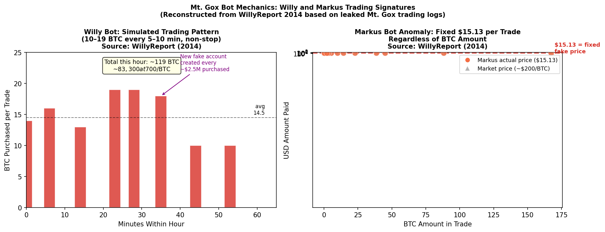
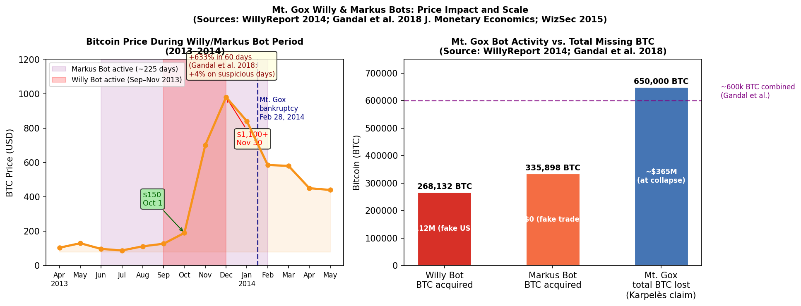

## 🌰 Background

Mt. Gox (Magic: The Gathering Online eXchange) was the world's dominant Bitcoin exchange from 2011 to early 2014, handling an estimated 70% of all global Bitcoin transactions at its peak. It was founded by Jed McCaleb and sold to French developer Mark Karpelès in 2011. By 2013 it was headquartered in Tokyo and processed millions of dollars in daily volume.

In May 2014, an anonymous researcher published **The WillyReport** — an analysis of leaked Mt. Gox trading logs covering April 2011 through November 2013 — and identified two automated trading bots, named **Markus** and **Willy**, operating inside the exchange. These bots purchased hundreds of thousands of Bitcoin using fictitious USD balances: money that did not exist. The transactions were real, publicly reported trades that moved the Bitcoin market price, but the purchasing power behind them was fabricated.

This is the earliest documented case of systematic, insider-driven market manipulation in cryptocurrency history, and one of the most studied in the academic literature.

---

## 🌰 The Two Bots

### 🌰 Markus Bot

**Active period:** February 14, 2013 – September 27, 2013 (225 days)
**BTC acquired:** ~335,898 BTC (Gandal et al. 2018; WillyReport 2014)
**USD paid:** Effectively $0 — trades recorded fake prices

The Markus bot's defining anomaly was a **fixed USD amount of $15.13 per trade regardless of how many BTC were purchased**. A trade of 0.1 BTC and a trade of 167 BTC both showed $15.13 on the USD side. No real market participant would accept this pricing — it was the mechanical signature of a script writing directly to Mt. Gox's database, bypassing normal order-matching.

Additional Markus characteristics from WillyReport analysis:
- 🌰 Paid **zero trading fees** — normal users paid 0.6%. Fee exemption indicated special account status or database-level access
- 🌰 Purchased at completely random prices within the prevailing range — not price-sensitive, consistent with volume manipulation rather than profit-seeking
- 🌰 Active across a much longer window than Willy, creating sustained low-level buy pressure

*Figure 1: Left — Willy Bot simulated trading pattern: 10–19 BTC purchased every 5–10 minutes non-stop, creating relentless mechanical buy pressure. Right — Markus Bot anomaly: every trade regardless of BTC amount recorded exactly $15.13 USD paid (red dots), vs. the expected market price of ~$200/BTC at the time (gray triangles). Source: WillyReport (2014).*

### 🌰 Willy Bot

**Active period:** September 27, 2013 – November 30, 2013 (~49 accounts)
**BTC acquired:** ~268,132 BTC (Gandal et al. 2018; WillyReport 2014)
**Fake USD deployed:** ~$112 million
**Daily average:** ~4,962 BTC/day ≈ 18% of Mt. Gox daily BTC volume (Gandal et al. 2018)

Willy was the more aggressive and precisely engineered of the two bots. Its mechanical pattern:

1. 🌰 **Create a new user account** on Mt. Gox with a fictitious USD balance
2. 🌰 **Purchase 10–19 BTC every 5–10 minutes**, non-stop, around the clock
3. 🌰 **Continue until approximately $2.5 million worth of BTC** had been purchased
4. 🌰 **Create a new account** and repeat — the $2.5M allotment structure was a consistent signature throughout the log data

The WillyReport author identified this pattern across months of trading logs with statistical certainty: the purchase intervals, allotment sizes, and account creation cadence were identical across what appeared to be hundreds of distinct user accounts — all Willy.

WizSec's 2015 analysis (*"MtGox Investigation Update and Preliminary Release"*, February 19, 2015) added: Willy **accounted for more than 30% of all hourly trades** on Mt. Gox during its peak activity. On many days it was the single largest buyer on the exchange — an exchange that at the time was the global reference price for Bitcoin.

---

## 🌰 Market Manipulation Mechanism

The manipulation was **purchasing-side fabrication**: real trades on a real exchange using a fake source of funds, making the exchange's order book show genuine demand that did not exist.

The mechanism differs critically from wash trading:
- 🌰 **Wash trading** = the same actor buys and sells, inflating volume without net price effect
- 🌰 **Willy/Markus** = one-directional buying only, with fabricated USD — creating genuine net buy pressure that moved the spot price, which was then observed by external markets

Because Mt. Gox was the price-setting exchange (70% market share), the fake buying directly determined the global reference price for Bitcoin. Other exchanges used Mt. Gox as the benchmark. Arbitrageurs who observed elevated Mt. Gox prices would buy on other exchanges, spreading the manipulated price signal across the entire market.

---

## 🌰 Academic Evidence: Gandal et al. (2018)

The most rigorous peer-reviewed analysis is **"Price Manipulation in the Bitcoin Ecosystem"** by Neil Gandal (Tel Aviv University), JT Hamrick, Tyler Moore, and Tali Oberman, published in the *Journal of Monetary Economics*, Vol. 95, pp. 86–96 (2018).

### 🌰 Key Findings

Using the leaked Mt. Gox trading logs, Gandal et al. conducted statistical analysis of approximately 600,000 suspicious transactions:

- 🌰 **+4.3% average BTC price increase per day** when Markus or Willy were active, vs. a slight decline on clean days — statistically significant at **99% confidence** (Gandal et al. 2018, Table 3)
- 🌰 The manipulation "likely caused the unprecedented spike in the USD-BTC exchange rate in late 2013, when the rate jumped from around $150 to more than $1,000 in two months"
- 🌰 ~600,000 BTC "fraudulently acquired" across both bots — valued at approximately **$188 million** at weighted prices; WizSec estimates ~570,000 BTC across the combined Feb–Nov 2013 window
- 🌰 Willy averaged ~4,962 BTC/day ≈ **18% of Mt. Gox daily volume** — making it the dominant buyer on the world's largest Bitcoin exchange during the peak
- 🌰 "Even if the fraudulent activity is set aside, average trading volume on all major exchanges was much higher on days the bots were active" — fake activity attracted genuine trading, amplifying the signal

*Figure 2: Left — Bitcoin price April 2013 through May 2014, with Willy and Markus bot periods highlighted. BTC rose from ~$150 to over $1,100 during peak Willy activity, then collapsed following Mt. Gox's bankruptcy (February 28, 2014). Right — BTC acquired by each bot vs. total Mt. Gox losses. Sources: WillyReport (2014); Gandal et al. (2018); CoinMarketCap historical.*

### 🌰 The WillyReport (2014)

Published anonymously at willyreport.wordpress.com in May 2014. The author analyzed Mt. Gox trading logs leaked on **March 9, 2014** — a 2.7 million row dataset covering every trade from April 2011 through November 2013. The identity of the analyst was never confirmed. The report:
- Identified the two bots through statistical pattern analysis
- Named them "Willy" and "Markus" based on internal markers in the log
- Noted the $15.13 fixed-price anomaly and the $2.5M allotment structure
- Was subsequently validated by WizSec and Gandal et al. using the same underlying data

---

## 🌰 The Inside Job Evidence

A critical question: were the bots operated by Mt. Gox insiders, or by external hackers who gained access?

WizSec's investigation (*"The Missing MtGox Bitcoins"*, April 2015; *"MtGox Investigation Update"*, February 2015) accumulated multiple lines of evidence pointing to internal operation:

1. 🌰 **Fee exemption** — Markus paid zero trading fees. The standard rate was 0.6%. Only an account with elevated internal permissions or direct database access would be exempt.

2. 🌰 **Traded while the API was offline** — Willy executed trades during periods when the public Mt. Gox API was unavailable to normal users (WizSec 2015). External attackers could not place orders during API outages; only someone with direct system access could.

3. 🌰 **Asian operating hours** — Willy's account creation cadence and activity windows corresponded to **East Asian business hours**, consistent with operation from Mt. Gox's Tokyo office.

4. 🌰 **High-numbered user IDs** — Both bots used account IDs from a sequential range not matching the user signup pattern of legitimate accounts, suggesting programmatic account creation with internal access.

5. 🌰 **Database-level writes** — The $15.13 fixed-price Markus anomaly and fabricated USD balances require writing directly to the database, bypassing normal order-matching validation. This requires root DB access or schema knowledge.

6. 🌰 **Timing relative to losses** — WizSec concluded most of Mt. Gox's theft occurred *before* the bots were active. The bots likely served to inflate BTC prices so the shrinking hot wallet *appeared* to cover outstanding liabilities — concealment, not profit.

Mark Karpelès has never publicly admitted to operating or authorizing the bots. He was not charged specifically in connection with them.

---

## 🌰 Mt. Gox Collapse Timeline

| Date | Event |
|------|-------|
| 2011–2012 | Ongoing theft of BTC from Mt. Gox hot wallet (WizSec estimate: began as early as 2011) |
| **Feb 14, 2013** | Markus Bot begins operation |
| **Sep 27, 2013** | Willy Bot begins — Markus ends same day |
| **Nov 30, 2013** | Willy Bot ends — BTC price has risen from ~$150 to ~$1,124 |
| Jan 2014 | Willy Bot ceases operation |
| **Feb 7, 2014** | Mt. Gox halts all BTC withdrawals, citing "technical issues" |
| **Feb 24, 2014** | Mt. Gox goes offline entirely |
| **Feb 28, 2014** | Mt. Gox files for bankruptcy protection in Tokyo District Court |
| Mar 9, 2014 | Mt. Gox trading logs leaked — WillyReport analysis begins |
| May 2014 | WillyReport published |
| Feb 2015 | WizSec publishes interim investigation findings |
| Apr 2015 | WizSec publishes full "Missing MtGox Bitcoins" report |
| 2018 | Gandal et al. published in Journal of Monetary Economics |
| **Mar 15, 2019** | Mark Karpelès convicted of data manipulation by Tokyo District Court — 30-month suspended sentence |
| Jun 2020 | Tokyo High Court rejects Karpelès's appeal |

### 🌰 Scale of Losses

- 🌰 **Karpelès's claim:** 850,000 BTC lost (later revised downward)
- 🌰 **WizSec estimate:** ~650,000 BTC unaccounted for
- 🌰 **USD value at collapse (~$580/BTC):** approximately $473 million
- 🌰 **Creditor claims:** approximately 24,000 creditors filed claims in bankruptcy

---

## 🌰 Karpelès Prosecution

Tokyo prosecutors indicted Karpelès on charges including **embezzlement** and **aggravated breach of trust**. On March 15, 2019:

- 🌰 **Convicted of:** data manipulation — falsifying Mt. Gox's financial records to inflate the exchange's holdings by approximately **$33.5 million**
- 🌰 **Acquitted of:** embezzlement (the court found insufficient evidence he personally took the missing BTC)
- 🌰 **Sentence:** 30 months in prison, **suspended for 4 years** — no time served
- 🌰 The court stated Karpelès had "inflicted massive harm to the trust of his users" and there was "no excuse" for his actions

The Tokyo High Court rejected his appeal in June 2020.

No charges were ever filed specifically in connection with the Willy or Markus bots.

---

## 🌰 Market Impact After Collapse

Bitcoin's price trajectory following Mt. Gox's bankruptcy illustrates the scale of the manipulation's distortion:

- 🌰 **Peak (Nov 30, 2013):** ~$1,100 — driven primarily by fabricated bot buying
- 🌰 **Mt. Gox bankruptcy (Feb 28, 2014):** ~$585 — 47% decline from peak
- 🌰 **Jun 2014:** ~$560 — continued decline as market absorbed the real supply/demand signal
- 🌰 **Jan 2015:** ~$170 — BTC returned close to pre-manipulation levels
- 🌰 The price did not sustainably recover above $1,000 until December 2016 — **three full years** after the manipulated peak

The Gandal et al. study's implication is stark: the Bitcoin "bull run" of 2013 that introduced cryptocurrency to mainstream media attention was driven substantially by fictitious trading, not organic demand.

---

## 🌰 Comparison to Other Manipulation Cases

| Factor | Mt. Gox Willy/Markus | Tether/Bitfinex | PlusToken |
|--------|---------------------|-----------------|-----------|
| Mechanism | Fabricated USD balances | Unbacked stablecoin | Ponzi exit dumping |
| Direction | Bullish (fake buying) | Bullish (real BTC buying) | Bearish (selling) |
| Scale | ~600k BTC, $188M fake | $3B USDT unbacked | 194k BTC ($3.9B) |
| Evidence | Leaked DB logs + academic | Blockchain + CFTC | Blockchain + prosecution |
| Academic paper | Gandal et al. 2018 JME | Griffin & Shams 2020 JoF | Chainalysis reports |
| Regulatory outcome | 30-month suspended sentence | $59.5M in fines | $4.2B seized, 109 arrested |
| Exchange market share | 70% — global price-setter | Bitfinex only | Multiple exchanges |

Mt. Gox is unique in that the manipulation operated at the **database layer** — not through market orders or stablecoin issuance, but by writing fake balances directly into the exchange's records. No external market surveillance tool could have detected it; it required a leak of the internal database.

---

## 🌰 References

1. 🌰 WillyReport. (2014, May). *The Willy Report: Proof of massive fraudulent trading activity at Mt. Gox, and how it has affected the price of Bitcoin*. willyreport.wordpress.com
2. 🌰 Gandal, N., Hamrick, J.T., Moore, T., & Oberman, T. (2018). *Price Manipulation in the Bitcoin Ecosystem*. Journal of Monetary Economics, 95, 86–96. doi:10.1016/j.jmoneco.2017.12.004
3. 🌰 WizSec (Kim Nilsson). (2015, February 19). *MtGox Investigation Update and Preliminary Release*. blog.wizsec.jp
4. 🌰 WizSec (Kim Nilsson). (2015, April 19). *The Missing MtGox Bitcoins*. blog.wizsec.jp
5. 🌰 CoinDesk. (2014, May 26). *A Bot Named Willy: Did Mt. Gox's Automated Trading Pump Bitcoin's Price?* coindesk.com
6. 🌰 Tokyo District Court. (2019, March 15). *Judgment against Mark Karpelès*. Reported by CoinDesk, Japan Times.
7. 🌰 Tokyo High Court. (2020, June 12). *Rejection of Karpelès appeal*. Reported by CoinDesk.
8. 🌰 Bitcoin Magazine. (2018, January 16). *Study: Late 2013 Bitcoin Bubble Fueled By Suspicious Trading Activity On Mt. Gox*. (covering Gandal et al.)
9. 🌰 TechCrunch. (2018, January 15). *Researchers find that one person likely drove Bitcoin from $150 to $1,000*.
10. 🌰 Mt. Gox Co., Ltd. (2014, February 28). *Voluntary bankruptcy filing*. Tokyo District Court, Case No. 2014 (Bankruptcy) 3830.
