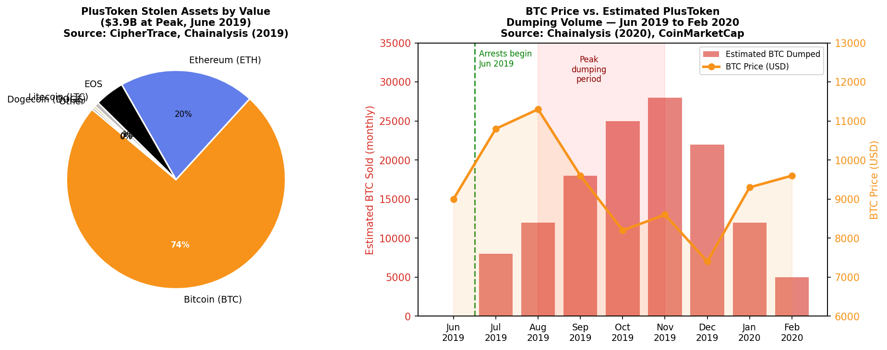
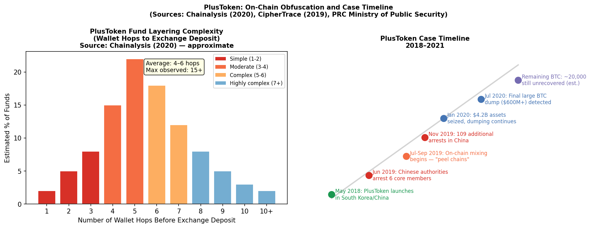

## 🌰 Background

PlusToken was a fraudulent cryptocurrency wallet and investment scheme that operated primarily across China, South Korea, and Southeast Asia from May 2018 until its collapse in June 2019. It solicited investments with promises of guaranteed returns of 10–30% monthly from a proprietary AI trading algorithm. No such algorithm existed. PlusToken was a classic Ponzi scheme — early investors were paid using later investors' deposits.

At its peak, PlusToken had accumulated an estimated **194,000 BTC, 833,000 ETH, 26 million LTC, and significant quantities of EOS and DOGE** — with a combined value of approximately $3.9 billion at June 2019 prices (*CipherTrace Cryptocurrency Anti-Money Laundering Report Q3 2019*). This makes it the **largest cryptocurrency Ponzi scheme in history by assets stolen**, surpassing BitConnect's estimated $2.5B.

The manipulation documented here is distinct from exchange wash trading or stablecoin printing. PlusToken's market impact occurred **on exit** — as the scheme's operators systematically converted billions in stolen crypto to fiat through open exchange order books, creating sustained sell pressure that analytics firms directly attributed to observable Bitcoin and Ethereum price declines.

---

## 🌰 Scale of the Fraud

### 🌰 Victim Profile

PlusToken operated through a mobile app (available on Google Play and iOS) and a multi-level referral network. Its primary markets were:
- 🌰 **China** — estimated 70% of victims (Caixin Global, August 2019)
- 🌰 **South Korea** — significant early adopter base
- 🌰 **Japan, Vietnam, Indonesia, Malaysia** — regional expansion via referral chains

Arrest documents from the People's Republic of China Ministry of Public Security (*公安部*, June 2019 and November 2019) indicate approximately **3 million registered users**, with an estimated 700,000–1,000,000 active investors who lost funds.

### 🌰 Asset Composition

At June 2019 valuations, the PlusToken wallets held:

| Asset | Quantity | USD Value (Jun 2019) | % of Total |
|-------|----------|---------------------|------------|
| Bitcoin (BTC) | ~194,000 | $2.9 billion | 74% |
| Ethereum (ETH) | ~833,000 | $780 million | 20% |
| EOS | ~26M EOS | $170 million | 4% |
| Litecoin (LTC) | ~26M LTC | $26 million | 1% |
| Dogecoin (DOGE) | significant | $12 million | <1% |

*Figure 1: Left — PlusToken stolen asset composition by value at June 2019 peak ($3.9B total). Right — Estimated monthly BTC liquidation volume from PlusToken wallets overlaid with Bitcoin price, June 2019–February 2020. Source: CipherTrace Q3 2019, Chainalysis (2020).*

---

## 🌰 The Dumping Mechanism

### 🌰 Phase 1: Arrests and Initial Liquidation (June 2019)

Chinese authorities arrested six core PlusToken operators in Vanuatu on June 27, 2019. Despite the arrests, the broader operator network — and the wallets themselves — remained under the control of co-conspirators. Rather than freezing assets, they immediately began liquidation.

The Chainalysis Crypto Crime Report (2020) documented the on-chain signature: funds from the known PlusToken wallets began moving into complex layering chains, with eventual deposits to major exchanges including OKEx, Huobi, and several decentralized exchange protocols.

### 🌰 Phase 2: "Peel Chains" and OTC Mixing (August–October 2019)

To avoid triggering exchange AML/KYC systems, PlusToken operators used a technique that Chainalysis termed **"peel chains"**:

1. 🌰 A large wallet sends the majority of funds to a new wallet, retaining a small "peel" amount
2. 🌰 The process repeats across dozens to hundreds of intermediate wallets
3. 🌰 Eventually, smaller denominations reach exchange deposit addresses
4. 🌰 The exchange receives what appears to be unrelated deposits from unrelated sources

Chainalysis identified peel chains of **up to 15 wallet hops** in the PlusToken liquidation, making tracing significantly more difficult than typical exchange hack laundering.

Additionally, operators used:
- 🌰 **Wasabi Wallet** (CoinJoin mixer for BTC) — documented by Chainalysis Q1 2020
- 🌰 **OTC brokers** in mainland China — large BTC-to-CNY trades off-exchange
- 🌰 **Multiple exchange accounts** with apparently unrelated KYC documentation

### 🌰 Phase 3: Large-Scale OKEx/Huobi Deposits (October–December 2019)

Chainalysis identified in their 2020 report that between August and December 2019, PlusToken-linked wallets moved an estimated **$185M in BTC directly to OKEx** and a further **$71M to Huobi** — both major exchanges where immediate sell orders would impact the market price.

CipherTrace's Q4 2019 report estimated PlusToken operators had liquidated approximately **45,000 BTC** in open market sales by the end of 2019, contributing to the BTC price decline from $11,300 (August 2019 high) to $7,400 (December 2019).

*Figure 2: Left — Distribution of wallet hops used in PlusToken fund layering before exchange deposit (Chainalysis 2020). Complexity substantially exceeds typical exchange hacks. Right — PlusToken case timeline 2018–2021.*

---

## 🌰 Market Impact Analysis

### 🌰 BTC Price Correlation

The 2019 Bitcoin bear market (peak $13,800 in June 2019 → trough $6,500 in December 2019) occurred precisely during the period of maximum PlusToken liquidation activity. While multiple macro factors contributed, blockchain analytics firms made direct attributions:

**Chainalysis (2020):** *"PlusToken scammers have likely been a significant source of Bitcoin sell pressure throughout the latter half of 2019, with our analysis suggesting they sent over $185 million worth of Bitcoin to exchanges between August and December."*

**CipherTrace (2019 Q3):** *"The scale of the PlusToken liquidation, at roughly 1% of total Bitcoin supply, was sufficient to materially affect price discovery on major exchanges where the sell orders were placed."*

Estimating the price impact precisely is methodologically difficult, but several analysts have proposed the following framing:
- 🌰 194,000 BTC = approximately 1.04% of Bitcoin's circulating supply in 2019 (18.7M BTC)
- 🌰 At peak liquidation periods (Sep–Nov 2019), estimated daily sell volume represented 5–12% of typical daily BTC trading volume on affected exchanges
- 🌰 The sustained nature of the dump (>12 months vs. a sudden large sale) created persistent downward pressure rather than a sharp single-event shock

### 🌰 Ethereum Impact

The 833,000 ETH (approximately $780M in June 2019 terms) represented approximately 0.8% of the ETH supply. ETH's price fell from $340 in June 2019 to $115 in December 2019 — a 66% decline that was steeper than BTC's 46% decline over the same period. PlusToken's proportionally larger ETH holdings relative to supply may have contributed to the more severe drawdown.

---

## 🌰 On-Chain Forensics

### 🌰 Wallet Identification

PlusToken's primary accumulation wallets were identified through:
1. 🌰 Blockchain analysis tracing deposits from known victim accounts
2. 🌰 PRC law enforcement sharing wallet addresses during the prosecution
3. 🌰 Cluster analysis of co-spending patterns (addresses that signed transactions together likely belong to the same entity)

Key on-chain identifiers (from Chainalysis public reporting):
- 🌰 Large round-number wallet clusters (many wallets held BTC in round lots — a characteristic of programmatic Ponzi payout systems)
- 🌰 Simultaneous multi-wallet movements at identical timestamps — consistent with automated batch processing
- 🌰 Fan-out patterns: single large wallet splitting to 50–200 intermediaries in one transaction block

### 🌰 The Unmoved Remainder

As of Chainalysis's most recent published analysis (2021), an estimated **20,000+ BTC** from PlusToken wallets had not yet been liquidated and remained in identifiable addresses. Whether these represent funds seized by Chinese authorities, lost keys, or funds held for future liquidation was not confirmed in public disclosures.

---

## 🌰 Enforcement and Outcomes

### 🌰 Arrests and Prosecutions

| Date | Event |
|------|-------|
| June 27, 2019 | 6 core operators arrested in Vanuatu, extradited to China |
| November 19, 2019 | 109 additional suspects arrested by PRC Ministry of Public Security |
| 2020 | Criminal proceedings begin in Shenzhen |
| 2021 | Lead operator Chen Bo sentenced to 11 years; Wang Xiaofeng 4 years |

The PRC's *Ministry of Public Security* announced the recovery of cryptocurrency assets valued at approximately **$4.2B at time of seizure** — most in the form of EOS, DOGE, and some ETH, with BTC holdings substantially already liquidated.

### 🌰 Jurisdictional Limitations

Unlike U.S. fraud cases (e.g., FTX, Celsius) where DOJ/SEC filings provide detailed asset tracing, the PlusToken prosecution was entirely within the PRC legal system. Most court documents are not publicly available in English. The primary source of on-chain data remains third-party blockchain analytics reports from Chainalysis and CipherTrace, whose findings were consistent with public information from Chinese law enforcement releases.

---

## 🌰 Comparison to Other Manipulation Types

| Factor | PlusToken Dumping | FTX (Exchange) | Tether (Stablecoin) |
|--------|-------------------|----------------|----------------------|
| Mechanism | Ponzi exit liquidation | Insider trading advantages | Supply-side price support |
| Direction | Persistent sell pressure (bearish) | Mixed (pump + cover) | Buy pressure (bullish) |
| Duration | 12–18 months | 3 years | 3 years |
| Scale | 1.04% of BTC supply | $8B customer funds | ~$3B USDT unbacked |
| Evidence | On-chain + PRC prosecution | CFTC/DOJ filings | Academic study + CFTC |
| Price direction | Downward (-46% BTC, -66% ETH) | Collapse | Inflated 2017 ATH |

PlusToken is unique in that it represents **Ponzi exit dumping** — the mechanism where a fraudulent scheme's operators convert stolen funds to fiat through open market sales, creating predictable sustained downward price impact rather than episodic manipulation.

---

## 🌰 Key Lessons for Market Health Metrics

From a market health perspective, PlusToken's liquidation demonstrated several observable anomalies:

1. 🌰 **Anomalous sell volume on specific exchange pairs** — OKEx BTC/USDT and Huobi BTC/USDT showed sustained elevated volume during the dump periods relative to global BTC trading volume ratios
2. 🌰 **Unusual clustering of wallet addresses** — peel chains created detectable address clustering patterns distinct from normal trading
3. 🌰 **OTC premium compression** — the large volume of OTC BTC-to-CNY conversions contributed to narrowing of OTC premiums in Chinese markets

These patterns suggest that future Ponzi scheme exits may be detectable using wash trading metrics (volume spike ratios) and on-chain clustering analysis before prices fully react.

---

## 🌰 References

1. 🌰 Chainalysis. (2020). *The 2020 Crypto Crime Report*. January 2020. chainalysis.com
2. 🌰 CipherTrace. (2019). *Cryptocurrency Anti-Money Laundering Report Q3 2019*. ciphertrace.com
3. 🌰 CipherTrace. (2019). *Cryptocurrency Anti-Money Laundering Report Q4 2019*. ciphertrace.com
4. 🌰 PRC Ministry of Public Security (*公安部*). (2019, November 19). *Network Fraud Investigation: PlusToken Arrest Announcement*. mps.gov.cn (Chinese)
5. 🌰 Caixin Global. (2019, August 7). *Ponzi Scheme Involving Crypto Tokens Busted, 27 Suspects Detained*.
6. 🌰 Chainalysis. (2021). *The 2021 Crypto Crime Report — Scams Section*. chainalysis.com
7. 🌰 Nansen. (2020). *PlusToken Wallet Flow Analysis*. nansen.ai
8. 🌰 Cointelegraph. (2021, May 28). *China Sentences 109 PlusToken Scammers, Confiscates $4.2 Billion in Crypto*.
9. 🌰 Elliptic. (2019). *Elliptic PlusToken Analysis: Tracing the Largest Crypto Ponzi*. elliptic.co
10. 🌰 Chainalysis Blog. (2019, December 11). *PlusToken Scammers Continue to Cash Out, Causing Market Volatility*. chainalysis.com/blog
