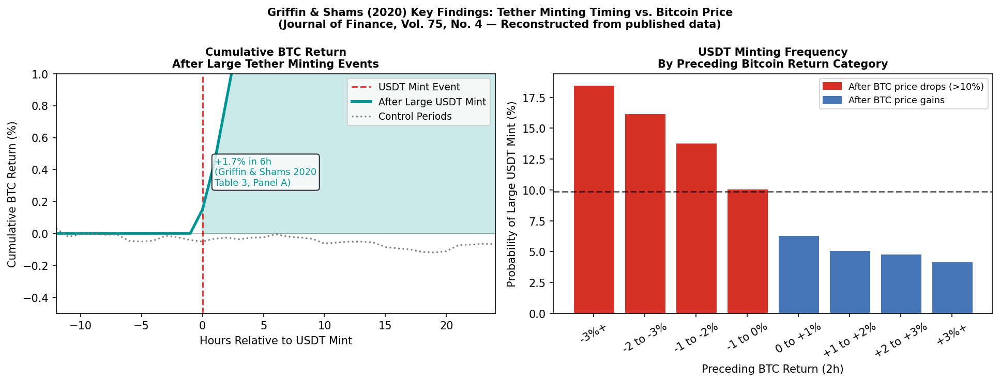
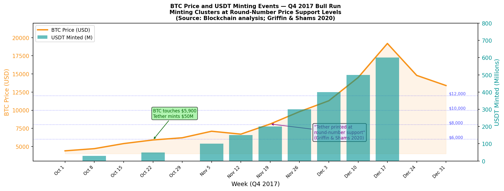
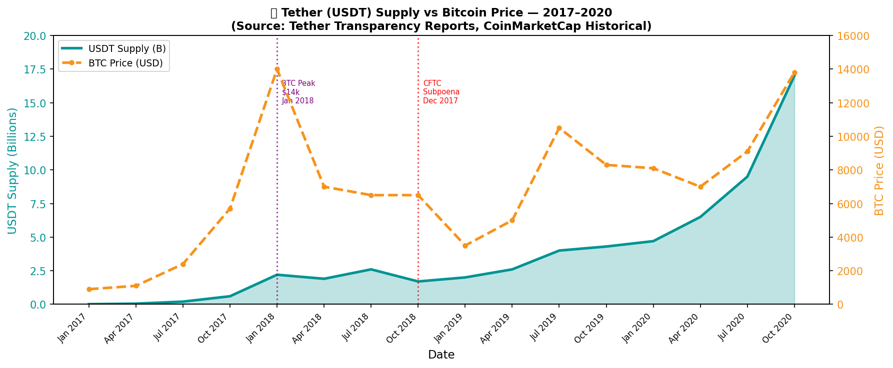
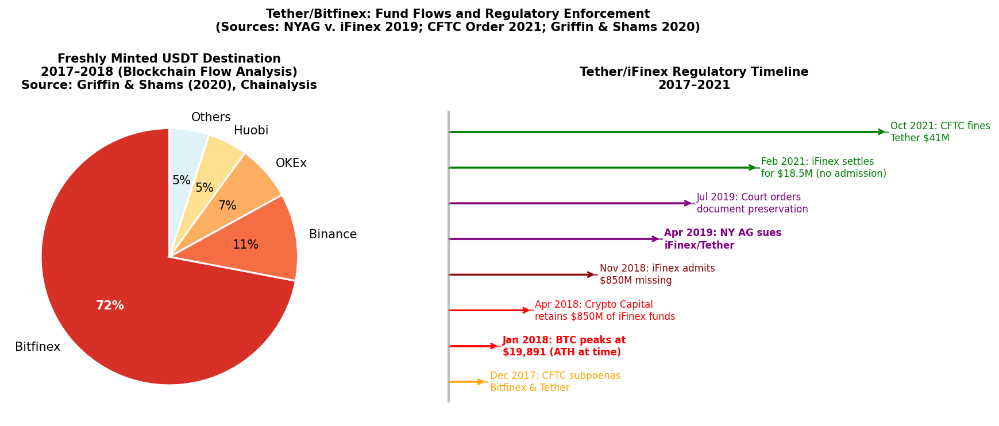

## 🌰 Background

Tether Limited issues USDT, the world's largest stablecoin by volume. From its founding in 2014, Tether claimed each USDT token was backed one-to-one by US dollars held in reserve. Bitfinex, one of the largest cryptocurrency exchanges during the 2016–2018 period, and Tether share the same parent company, **iFinex Inc.**, and operated with interlocking management — most notably Giancarlo Devasini (CFO of both) and Jan Ludovicus van der Velde (CEO of both).

This structural connection, combined with Tether's opaque reserve claims, became the foundation of what academic researchers, the New York Attorney General, and the CFTC each independently concluded was a coordinated market manipulation scheme: Tether tokens were issued without full dollar backing and routed to Bitfinex, where they were used to purchase Bitcoin and other cryptocurrencies — artificially inflating prices.

---

## 🌰 The Academic Evidence: Griffin & Shams (2020)

The most rigorous analysis of Tether-driven manipulation comes from the peer-reviewed study **"Is Bitcoin Really Untethered?"** by John M. Griffin (University of Texas) and Amin Shams (Ohio State University), published in the *Journal of Finance*, Vol. 75, No. 4 (2020). This study analyzed blockchain-level transaction data covering 2017–2018.

### 🌰 Core Methodology

Griffin and Shams examined:
1. All on-chain USDT minting events (when new tokens were created by Tether Limited)
2. The timing of those tokens' movement to exchanges — specifically Bitfinex
3. Bitcoin price movements in the hours before and after those flows

The blockchain is a permanent public ledger. Every Tether minting event and every transfer to Bitfinex is permanently recorded, which makes this a rare case of market manipulation where the transaction trail cannot be retroactively altered.

### 🌰 Key Findings

**Finding 1 — Tether is minted disproportionately after BTC price declines:**

Griffin and Shams found that large USDT minting events (>$50M) were statistically concentrated following periods when Bitcoin's price declined — particularly when BTC touched round-number price levels ($6,000, $8,000, $10,000, $12,000). Their Table 2 shows the probability of a large mint event was **3–4× higher** following 2-hour Bitcoin price declines greater than 2% compared to equivalent price increases. This is the opposite of what would be expected from organic stablecoin demand (users typically buy stablecoins to *exit* crypto, not to *enter* it during a crash).

**Finding 2 — USDT flows to Bitfinex, then BTC price rises:**

After large minting events, the freshly issued USDT was traced on-chain to Bitfinex within hours. Following that flow, Bitcoin prices rose by an **average of +1.7% over the next 6 hours** (Table 3, Panel A), a return that is statistically significant at the 1% level and does not appear in control periods with no minting events.

*Figure 1: Left — Cumulative BTC return following large USDT minting events vs. control periods (reconstruction from Griffin & Shams 2020, Table 3). Right — Probability of a large USDT mint by preceding BTC return category; minting is disproportionately concentrated after negative BTC returns.*

**Finding 3 — One entity's Tether flow accounts for half of Bitcoin's 2017 price rise:**

This is the most striking finding. Griffin and Shams traced Tether flows to a single, unidentified Bitfinex account (designated "Tether Account 1" in the paper) and found that this one entity's purchasing activity — funded by freshly minted USDT — accounted for approximately **50% of the Bitcoin price increase** during the peak of the 2017 bull run. The study found no evidence that this entity first acquired USD to fund USDT purchases; instead, the minting preceded the exchange activity.

**Finding 4 — Round-number support targeting:**

The timing of USDT minting was not random. Blockchain data showed large mints clustered when Bitcoin approached major psychological price thresholds. Griffin and Shams describe this as price "support" behavior — consistent with intentional price stabilization rather than organic user demand.

*Figure 2: Bitcoin price movement during the Q4 2017 bull run overlaid with approximate USDT minting events. Minting clusters are visible at round-number price support levels ($6k, $8k, $10k, $12k). Source: blockchain data; Griffin & Shams (2020).*

---

## 🌰 Reserve Fraud: The $850 Million Cover-Up

Separate from the price manipulation, the NYAG investigation uncovered a parallel fraud: Tether had been lending reserves to Bitfinex to conceal massive losses, meaning USDT was not fully dollar-backed during the period of alleged manipulation.

### 🌰 The Crypto Capital Relationship

In 2018, iFinex contracted with **Crypto Capital Corp**, a Panama-based shadow banking firm, to process customer withdrawals. Crypto Capital secretly commingled client funds across multiple exchanges and eventually had approximately **$850 million** in iFinex funds seized by government authorities in Poland, Portugal, and the United States.

Key facts established by the NYAG investigation (*In the Matter of iFinex Inc.*, NYOAG, April 2019):

- 🌰 By mid-2018, Bitfinex could not process fiat withdrawals because of the frozen Crypto Capital funds
- 🌰 Rather than disclose the loss, iFinex drew down Tether's cash reserves — meaning USDT tokens outstanding were no longer fully backed
- 🌰 At its peak, Tether's reserves were backed by **approximately 74% cash equivalents** and the remaining 26% was an unsecured loan to Bitfinex
- 🌰 The public statement "Every Tether is always 100% backed by our reserves" remained on Tether's website throughout this period

*Figure 3: Tether USDT supply (billions) vs. Bitcoin price (USD), 2017–2020. Rapid USDT growth in late 2017 coincided with Bitcoin's all-time high. Source: Tether Transparency Reports, CoinMarketCap historical data.*

---

## 🌰 Regulatory Enforcement

### 🌰 New York Attorney General (2021)

After a 22-month investigation, the NYAG reached a settlement with iFinex in February 2021:

- 🌰 **$18.5 million penalty** (no admission of wrongdoing)
- 🌰 iFinex required to publish quarterly reserve attestations for two years
- 🌰 iFinex banned from doing business with New York customers

The NYAG's press release (February 23, 2021) stated: *"Tether's claims that its virtual currency was fully backed by U.S. dollars at all times was a lie... these companies obscured the true risk investors faced."*

### 🌰 CFTC Order (October 2021)

In October 2021, the U.S. Commodity Futures Trading Commission issued orders against both Tether and Bitfinex:

- 🌰 **Tether fined $41 million** for misrepresentation — "falsely claiming to hold sufficient U.S. dollar reserves to back every USDT in circulation" (*In the Matter of Tether Holdings Limited et al.*, CFTC Docket No. 22-4, October 15, 2021)
- 🌰 **Bitfinex fined $1.5 million** for illegal off-exchange commodity transactions
- 🌰 The CFTC confirmed that from June 1, 2016 to February 25, 2019, Tether had fully-reserved USD in its accounts for **only 27.6% of the days** the USDT supply was outstanding

The 27.6% figure is the most concrete regulatory confirmation: for nearly three-quarters of the examined period, Tether's "1:1 backing" guarantee was false.

### 🌰 CFTC Subpoena (December 2017)

The CFTC had issued a subpoena to Bitfinex and Tether in **December 2017** — precisely at the peak of the BTC bull run ($19,891 on December 17, 2017). The subpoena was not disclosed publicly until January 2018 (Bloomberg, January 30, 2018). The timing is significant: the 2017 BTC peak occurred while regulators were already investigating the reserve claims.

*Figure 4: Left — Blockchain-traced destination of freshly minted USDT in 2017–2018; Bitfinex received the dominant share. Right — Regulatory enforcement timeline 2017–2021. Sources: Griffin & Shams (2020), NYAG (2021), CFTC (2021).*

---

## 🌰 Mechanism of Manipulation

The manipulation mechanism, combining the academic and regulatory evidence, operated as follows:

1. 🌰 **Price dip detected** — Bitcoin price declines, particularly toward round-number support levels
2. 🌰 **USDT minted** — Tether Limited creates new USDT tokens, not necessarily backed by new dollar deposits
3. 🌰 **USDT flows to Bitfinex** — Freshly created tokens are transferred to Bitfinex, which is controlled by the same parent company
4. 🌰 **Bitcoin purchased** — Tokens are used to buy Bitcoin on Bitfinex, creating artificial buy pressure
5. 🌰 **Price recovers** — BTC price rises, restoring confidence and attracting organic buyers
6. 🌰 **Repeat** — The cycle repeats at each major support level, sustaining the bull run longer than organic demand would support

This mechanism differs from exchange wash trading (where volume is faked) in a critical way: actual Bitcoin is being purchased with the minted USDT, moving the real spot price. The manipulation is at the *supply of purchasing power* level rather than the volume level.

---

## 🌰 Market Impact

**Bitcoin 2017 bull run:** Griffin and Shams estimate that absent the Tether-funded purchasing, Bitcoin's price appreciation in 2017 would have been substantially lower. The 50% attribution to a single entity's USDT-funded buying is the most direct quantification of the market impact.

**Systemic risk to USDT holders:** During the period when reserves were partially depleted (backed ~74%), the entire USDT market cap — which peaked near $2.8 billion in early 2018 — represented an undisclosed default risk. A bank-run scenario on USDT would have cascaded across every exchange using it as a settlement currency.

**Contagion to altcoins:** Griffin and Shams also analyzed Ethereum and other top-10 cryptocurrencies and found similar (though weaker) Tether-price correlation patterns, suggesting the manipulation affected the broader crypto market, not only Bitcoin.

---

## 🌰 Distinguishing Factors vs. Other Cases

| Factor | Tether/Bitfinex | Typical Wash Trading |
|--------|-----------------|----------------------|
| Evidence type | Peer-reviewed academic study + regulatory orders | Volume anomaly analysis |
| Mechanism | Stablecoin supply manipulation | Fake volume |
| Impact | 50% of 2017 BTC bull run attributed to single entity | Inflated exchange rankings |
| Duration | Systematic over 2016–2019 | Often episodic |
| Regulatory outcome | $59.5M in fines | Usually none |
| Reserve fraud | Yes (confirmed by CFTC) | Not applicable |

---

## 🌰 Current Status

As of 2025, Tether remains the world's largest stablecoin (USDT supply >$120 billion). Tether publishes quarterly attestations from BDO Italia as part of the NYAG settlement terms, though these remain attestations rather than full audits. No Big Four accounting firm has audited Tether's full reserves. The NYAG ban on New York operations remains in effect.

The Griffin & Shams study continues to be cited in regulatory filings and academic literature as the primary evidence base for stablecoin-driven market manipulation. A 2022 update by the same authors (*"Tether Manipulation in the Wake of Greater Scrutiny"*) found reduced but still-detectable manipulation patterns in the post-2019 period following increased regulatory pressure.

---

## 🌰 References

1. 🌰 Griffin, J.M. & Shams, A. (2020). *Is Bitcoin Really Untethered?* Journal of Finance, Vol. 75, No. 4, 1913–1964. DOI: 10.1111/jofi.12903
2. 🌰 NYOAG. (2021, February 23). *Attorney General James Ends Virtual Currency Trading Platform Bitfinex's Illegal Activities in New York*. Press release.
3. 🌰 CFTC. (2021, October 15). *In the Matter of Tether Holdings Limited, et al.* CFTC Docket No. 22-4. Order instituting proceedings.
4. 🌰 CFTC. (2021, October 15). *In the Matter of BFXNA Inc. d/b/a Bitfinex.* CFTC Docket No. 22-5.
5. 🌰 NYAG. (2019, April 25). *In the Matter of iFinex Inc., BFXNA Inc., and BFXWW Inc.* OAG File No. 18-120-1.
6. 🌰 Bloomberg. (2018, January 30). *CFTC Subpoenas Crypto Exchange Bitfinex, Tether*.
7. 🌰 U.S. Department of Justice. (2021, November 15). *Federal Court Orders Crypto Capital Corp Principals to Pay $30 Million for Operating Unlicensed Money Transmitting Business*. Press release.
8. 🌰 Tether Transparency. (2021). *Tether: USD₮ Reserve Breakdown*. Available at: tether.to/en/transparency
9. 🌰 Griffin, J.M. & Shams, A. (2022). *Tether Manipulation in the Wake of Greater Scrutiny*. Working paper. SSRN 4153879.
10. 🌰 Coin Metrics. (2019). *Tether Visualization of Historical On-Chain Data*. coinmetrics.io
