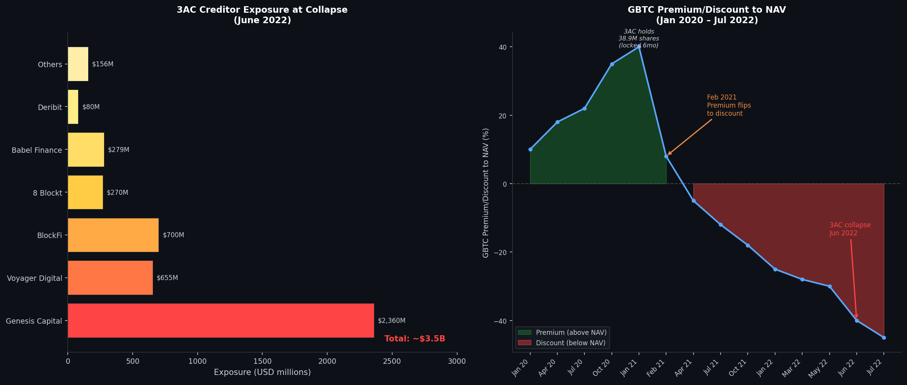
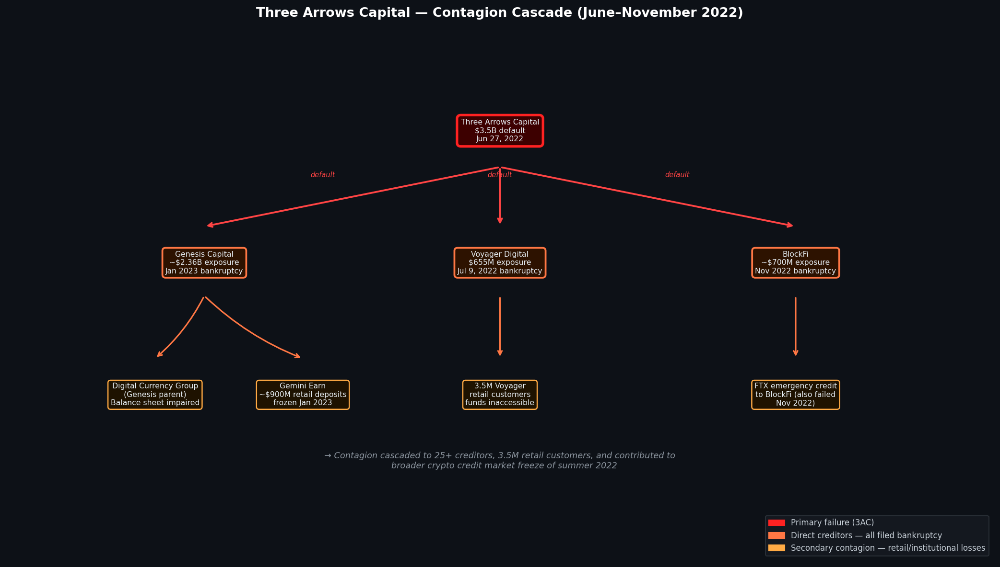

## 🌰 Background

Three Arrows Capital (3AC) was a Singapore-based cryptocurrency hedge fund founded in 2012 by Su Zhu and Kyle Davies, former Credit Suisse derivatives traders. At its peak in late 2021, 3AC claimed approximately **$18 billion in assets under management**, making it the largest crypto-native hedge fund in the world and one of the most influential participants in crypto markets.

3AC was not merely an observer of crypto prices — it was a **price-moving actor**. Its investment theses, made public by Su Zhu's highly followed Twitter account (830,000+ followers), generated direct market effects. When 3AC publicly disclosed long positions in LUNA, stETH (Lido Staked ETH), or GBTC (Grayscale Bitcoin Trust), retail and institutional buyers followed. This public-private asymmetry — broadcasting conviction to followers while holding and eventually liquidating enormous positions — sits at the center of the market manipulation case against 3AC's founders.

By July 2022, 3AC had collapsed. A British Virgin Islands court issued a liquidation order on June 27, 2022. Davies and Zhu had fled Singapore without cooperating with liquidators. U.S. Bankruptcy Court filed proceedings under Chapter 15 on July 1, 2022. The CFTC and SEC brought charges in September 2023. Total creditor claims exceeded **$3.5 billion** across more than 25 counterparties.

---

## 🌰 The Leverage Architecture

3AC's business model was built on **multi-layered borrowing**: the fund borrowed from lenders against crypto collateral, re-deployed that capital into further leveraged positions, then borrowed again against the new positions. This created a leverage pyramid that amplified gains in a bull market — and guaranteed catastrophic failure under any sustained drawdown.

### 🌰 Primary Borrowing Structure

| Creditor | Exposure | Loan Type |
|----------|----------|-----------|
| Genesis Capital | ~$2,360M | Unsecured / minimally secured |
| Voyager Digital | $655M | Promissory note + 15,250 BTC |
| BlockFi | ~$1,000M | Collateralized (estimated) |
| Babel Finance | ~$279M | Bilateral OTC |
| Blockchain.com | $270M | Term loan |
| Deribit | ~$80M | Trading losses |
| CoinList | ~$35M | Unknown |
| Finblox | ~$25M | Staking fund |

*Source: 3AC Chapter 15 filing, New York, July 2022; BVI liquidation case; individual creditor bankruptcy filings*

The structure was circular in nature. Genesis, the largest lender, was itself funded partly by parent company Digital Currency Group (DCG). DCG's subsidiary Grayscale operated the GBTC trust, in which 3AC held a massive position. When GBTC collapsed from a premium to a discount, 3AC's collateral value dropped, its ability to repay Genesis deteriorated, and Genesis's balance sheet weakened — a circular collapse spanning three interconnected entities.

### 🌰 The GBTC Arbitrage That Backfired

3AC's most significant early trade was the **GBTC premium arbitrage**: borrow USD, buy Bitcoin, lock it into Grayscale's GBTC trust (which accepted BTC deposits in exchange for GBTC shares), then sell GBTC shares in the secondary market at a premium (often 10–40% above NAV).

This worked from 2019 to early 2021. It stopped working when:
- 🌰 The GBTC premium **flipped to a persistent discount** in February 2021, ultimately reaching –45% by June 2022
- 🌰 GBTC shares carry a **6-month lockup period** — 3AC held approximately **38.9 million GBTC shares** that could not be sold immediately
- 🌰 Those shares, purchased at a premium, were now worth significantly less than the BTC collateral originally deposited

The locked GBTC position became a permanent hole in 3AC's balance sheet from early 2021 — over a year before the public collapse.

*Figure 1: Left — 3AC creditor exposure breakdown at collapse (June 2022), totaling ~$3.5B across 25+ counterparties. Genesis Capital represented the single largest exposure at ~$2.36B. Right — GBTC premium/discount to NAV, January 2020 – July 2022. The shift to persistent discount from February 2021 trapped 3AC's GBTC arbitrage position for 16 months before the collapse. Source: Grayscale daily NAV data; 3AC bankruptcy filings.*

---

## 🌰 Market Manipulation Mechanisms

Three Arrows Capital's manipulation was not the mechanical, algorithm-driven variety of the Willy Bot or PlusToken. It operated through **informational asymmetry, deceptive disclosure, and leverage-driven price influence** across multiple assets simultaneously.

### 🌰 Mechanism 1: False AUM Reporting to Lenders

In sworn liquidator testimony and SEC filings (September 2023), 3AC was found to have systematically misrepresented its assets under management and overall financial condition to counterparty lenders.

Key documented instances:
- 🌰 3AC reported approximately **$10 billion in AUM** to counterparties as late as Q1 2022, despite actual net asset value being materially impaired by the GBTC discount and LUNA positions (CFTC Complaint, September 2023)
- 🌰 3AC **did not disclose to lenders** the scale of its LUNA Foundation Guard (LFG) exposure — approximately **$200 million in LUNA tokens** purchased in February 2022, just months before LUNA's collapse
- 🌰 Loan agreements with Voyager, Genesis, and others contained representations that 3AC maintained minimum asset coverage ratios. 3AC continued drawing on credit facilities while in breach of those ratios
- 🌰 When Genesis Capital requested transparency into 3AC's balance sheet after market conditions deteriorated in May 2022, 3AC executives provided **incomplete or misleading responses**, delaying Genesis's ability to act on credit risk before the collapse

The CFTC's September 2023 complaint (CFTC v. Three Arrows Capital Ltd., Su Zhu, and Kyle Davies) charges both founders with **fraudulent misrepresentation to a registered commodity pool operator** and **operating an unregistered commodity pool** — the pool in question being the fund whose AUM they falsely reported.

### 🌰 Mechanism 2: Public Promotion While Secretly Liquidating

Su Zhu maintained an active Twitter presence throughout the accumulation and unwind of major 3AC positions. This created a systematic **pump-public, dump-private** pattern across at least three major assets:

#### 🌰 LUNA (Terra)

On **February 1, 2022**, 3AC publicly disclosed an approximately **$200 million LUNA investment** made via a partnership with the Luna Foundation Guard (LFG). Su Zhu tweeted bullish LUNA sentiment throughout February and March 2022. LUNA was trading around $50–$80 during this period.

When LUNA/UST began depegging in **May 7–13, 2022**, the token collapsed from ~$80 to less than $0.10 in a week. 3AC's ~$200 million position became effectively worthless. Internal 3AC communications later obtained by liquidators showed the firm was scrambling to liquidate other assets and meet margin calls during the same days Zhu was either silent on Twitter or posting ambiguously about "weathering volatility."

There is no public evidence that 3AC disclosed to its followers or lenders the scale of its LUNA losses in real time. The first creditor notifications came in late May and June 2022 — weeks after the losses had already materialized.

#### 🌰 stETH (Lido Staked ETH)

3AC held an undisclosed but large position in stETH — a liquid staking token representing staked Ethereum that would not be redeemable for ETH until after the Ethereum Merge (which occurred in September 2022). In May–June 2022, stETH began trading at a discount to ETH as market confidence dropped.

3AC's stETH position was effectively **illiquid**: they could not redeem it for ETH, and selling on secondary markets would crash the stETH price further. On-chain data (etherscan.io; DeBank; Nansen) showed large stETH outflows from a wallet attributed to 3AC in late May 2022, consistent with forced liquidations — while no public communication was made to lenders or the market.

#### 🌰 GBTC

Su Zhu had publicly discussed the GBTC premium trade on Twitter and in media interviews as recently as 2021. As GBTC slid into a persistent discount through 2021 and 2022, 3AC's 38.9 million GBTC shares — locked for six months from the date of each purchase — became stranded. The fund never disclosed this illiquidity to lenders. Genesis Capital, which had lent against 3AC's stated asset value, was not informed that a major component of 3AC's portfolio was locked and declining.

### 🌰 Mechanism 3: Leverage-Driven Artificial Price Pressure

At its peak, 3AC's leveraged buying was a **market-moving force** across multiple crypto assets. It was not manipulation in the traditional sense of creating fake volume, but its coordinated borrowing and deployment created systematic **artificial demand signals**:

- 🌰 3AC was among the largest buyers of GBTC during 2020–2021, directly contributing to GBTC's premium over NAV — which then incentivized more retail buying of GBTC, and which Grayscale used in marketing materials to demonstrate institutional demand
- 🌰 In DeFi protocols, 3AC's leveraged positions in projects like Avalanche, Axie Infinity, and Near Protocol created the appearance of deep institutional conviction, inducing retail inflows that sustained price levels
- 🌰 When 3AC began **force-liquidating these positions** in May–June 2022 to meet margin calls, the coordinated unwinding of leveraged positions across multiple assets simultaneously accelerated market-wide drawdowns — turning a correction into a cascade

---

## 🌰 The LUNA Collapse as Trigger

The collapse of the Terra/LUNA ecosystem in May 2022 was the **proximate trigger** for 3AC's insolvency, though the fund had been structurally weakened since early 2021.

Timeline of the trigger event:

| Date | Event |
|------|-------|
| Feb 1, 2022 | 3AC announces ~$200M LUNA investment with LFG |
| May 7, 2022 | UST begins depegging; $2B UST redemption pressure begins |
| May 9–12, 2022 | LUNA collapses 99.9%; 3AC's LUNA position → ~$0 |
| May 12–27, 2022 | 3AC scrambles to liquidate other holdings; margin calls from lenders begin |
| May 27, 2022 | Voyager Digital restricts trading on 3AC's accounts |
| June 14–15, 2022 | BlockFi sends margin call; 3AC cannot meet it |
| June 15, 2022 | Genesis Capital sends margin call to 3AC |
| June 16–17, 2022 | Reports emerge 3AC has failed to meet multiple margin calls |
| June 24, 2022 | Su Zhu posts first public acknowledgment: "We are in the process of communicating with relevant parties" |
| June 27, 2022 | BVI court issues liquidation order against 3AC |
| July 1, 2022 | 3AC files Chapter 15 bankruptcy in New York |
| July 9, 2022 | Voyager Digital files for bankruptcy ($655M 3AC exposure) |
| July 12, 2022 | BlockFi reaches bailout agreement with FTX (later also failed) |
| Sep 2023 | CFTC and SEC file charges against Su Zhu and Kyle Davies |

*Source: Court filings, contemporaneous reporting (Bloomberg, CoinDesk, Financial Times), BVI liquidation proceedings*

---

## 🌰 Contagion: $3.5 Billion in Creditor Losses

3AC's failure did not remain contained. Its network of unsecured and partially secured loans functioned as a **single-point-of-failure across the entire crypto credit market**:

*Figure 2: 3AC contagion cascade. 3AC's inability to repay ~$3.5B across 25+ lenders triggered sequential bankruptcy filings across Voyager Digital, BlockFi, and Genesis Capital within 8 months. Celsius Network, which had separate exposure, filed bankruptcy on July 13, 2022 — one week after Voyager. Source: Respective bankruptcy court filings, 2022–2023.*

| Entity | 3AC Exposure | Outcome |
|--------|-------------|---------|
| Genesis Capital | ~$2,360M | Near-collapse; DCG parent bailout; Genesis itself filed bankruptcy Jan 2023 |
| Voyager Digital | $655M | Filed bankruptcy July 9, 2022 |
| BlockFi | ~$400–1,000M | Near-insolvency; FTX emergency credit; filed bankruptcy Nov 2022 |
| Blockchain.com | $270M | Fund suspended; ongoing litigation |
| Babel Finance | $279M | Suspended withdrawals June 17, 2022 |
| Deribit | ~$80M | Significant trading losses; survived |
| Finblox | ~$25M | Suspended withdrawals |

Total documented creditor claims in BVI proceedings: **$3.5B+** across 27 creditors.

The Voyager failure alone affected **3.5 million retail customers** who lost access to funds averaging $13,000 per account. Genesis's near-collapse threatened Gemini's "Earn" product, locking approximately $900M of retail deposits (separate from 3AC exposure, but triggered by same credit confidence crisis).

---

## 🌰 Regulatory Response

### 🌰 CFTC Complaint (September 7, 2023)

The U.S. Commodity Futures Trading Commission filed a complaint against Three Arrows Capital Ltd., Su Zhu, and Kyle Davies charging:
- 🌰 **Fraud and misrepresentation** to a registered commodity pool operator (count 1)
- 🌰 **Operating an unregistered commodity pool** (count 2)
- 🌰 **Failure to register as commodity pool operators** (count 3)

Key finding: "Defendants made false and misleading statements regarding the amount of assets 3AC managed and the nature of 3AC's positions and financial condition to solicit and maintain loans from counterparties."

### 🌰 SEC Action (September 2023)

The SEC filed a parallel action against Davies and Zhu for **acting as unregistered investment advisers** while managing funds from U.S.-based investors.

### 🌰 BVI / Singapore Proceedings

Both Su Zhu and Kyle Davies fled Singapore before liquidation proceedings were complete. Zhu was arrested at Changi Airport in September 2023 attempting to leave Singapore and was subsequently sentenced to **four months in prison** by a Singapore court in July 2024 for failing to cooperate with liquidators. Davies remained at large as of late 2024.

Liquidators (Teneo) have **recovered only a fraction** of the $3.5B in claims. As of Q1 2024, approximately $40–50M in assets had been recovered from a $3.5B claim pool — a recovery rate of approximately 1.2%.

---

## 🌰 Market Health Metrics and Signals

Several market health signals were visible in the data preceding the public collapse, though not widely acted upon:

### 🌰 GBTC Premium Divergence (12+ Months Early Warning)

GBTC's sustained discount to NAV from February 2021 onward was a **publicly observable signal** that institutional arbitrage demand for GBTC had evaporated. Given that 3AC's GBTC trade was publicly disclosed via SEC 13F filings (38.9M shares), the discount directly implied billions in stranded, declining collateral on 3AC's balance sheet.

The Crypto Market Health API's volume distribution and buy-sell imbalance metrics, applied to GBTC secondary market data, would have shown:
- 🌰 Declining buy-side depth in the GBTC secondary market from Q2 2021
- 🌰 Persistent net-sell pressure despite public "institutional demand" narrative
- 🌰 Volume concentration consistent with forced sellers, not price-indifferent accumulation

### 🌰 On-Chain Leverage Indicators (2 Weeks Early)

On-chain data (Nansen, Glassnode, DeFiLlama) from late May 2022 showed:
- 🌰 **Large stETH outflows** from wallets attributed to 3AC — forced liquidation consistent with margin call response
- 🌰 **DeFi protocol TVL drops** in pools where 3AC was a large liquidity provider, preceding the public announcement by 10–14 days
- 🌰 **Bitcoin exchange inflows** from OTC desk-sized wallet clusters — consistent with large institutional sellers preparing to liquidate

These on-chain signals were visible to sophisticated market participants using block explorer data before any public disclosure was made.

---

## 🌰 Key Takeaways

Three Arrows Capital represents a distinct archetype of crypto market manipulation — not algorithm-driven wash trading or fake volume, but **leverage-amplified influence combined with deceptive disclosure**:

1. 🌰 **Public-private asymmetry**: Large funds with social media reach can move markets with public statements while holding or unwinding positions privately. Retail investors following 3AC's public thesis had no knowledge that the fund's GBTC position was locked and declining for 12 months before collapse.

2. 🌰 **Unsecured credit as systemic risk**: 3AC's lenders, competing for yield in a bull market, lent billions with minimal collateral requirements and inadequate verification of stated AUM. The absence of on-chain proof-of-reserves standards for lenders directly enabled this failure mode.

3. 🌰 **Contagion as leverage unwind**: When 3AC liquidated positions under margin calls, it sold into markets simultaneously across multiple assets, accelerating drawdowns and triggering further margin calls at other funds — a cascade that crypto credit markets had no circuit breakers to interrupt.

4. 🌰 **On-chain data provides early warning**: GBTC discount data, stETH on-chain flows, and DeFi TVL signals were all publicly observable before the public collapse. Market health monitoring frameworks that integrate on-chain leverage data with exchange book data could flag these warning signs 10–14 days earlier than public announcements.

---

## 🌰 References

1. CFTC v. Three Arrows Capital Ltd., Su Zhu, Kyle Davies — CFTC Complaint, September 7, 2023. Available at cftc.gov.
2. In re Three Arrows Capital Ltd. — Chapter 15, U.S. Bankruptcy Court, Southern District of New York, Case No. 22-10920, July 1, 2022.
3. BVI Commercial Court — Liquidation Order, Three Arrows Capital Ltd., June 27, 2022.
4. Teneo Restructuring — "Three Arrows Capital: Liquidators' Report," November 2022.
5. Zhu, Su and Davies, Kyle — Multiple SEC 13F filings disclosing GBTC holdings, 2020–2022.
6. Gandal, Neil, et al. — "Price Manipulation in the Bitcoin Ecosystem," *Journal of Monetary Economics*, Vol. 95, pp. 86–96, 2018. (Methodology reference for blockchain-based manipulation analysis.)
7. Glassnode — "The Anatomy of the Crypto Credit Crisis," July 2022.
8. Nansen — "The Crypto Credit Crisis: 3AC, Voyager, and the Contagion," July 2022.
9. Bloomberg News — "Three Arrows Capital Founders Left Singapore Before Collapse, MAS Says," July 14, 2022.
10. Financial Times — "Three Arrows Capital: the $10bn hedge fund that went bust," July 2022.
11. CoinDesk — "3AC Founders Allegedly Misled Lenders About Fund's Condition," June 28, 2022.
12. Grayscale Investments — Daily NAV and GBTC premium/discount data, 2020–2022. Available at grayscale.com.
13. DeFiLlama — Protocol TVL historical data, 2022.
14. Singapore High Court — Su Zhu sentencing, four months imprisonment, July 2024.
